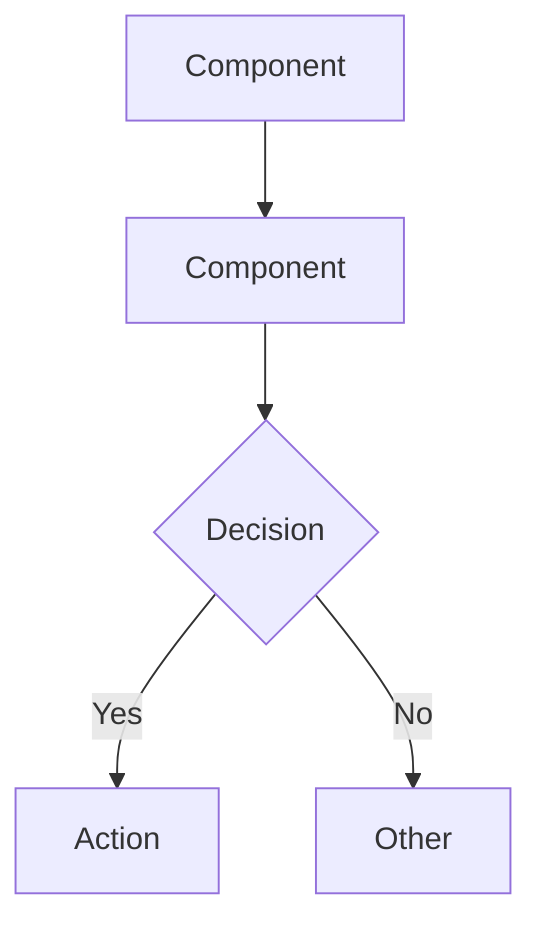
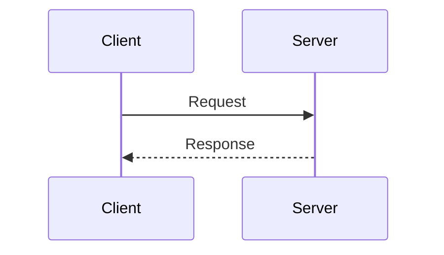
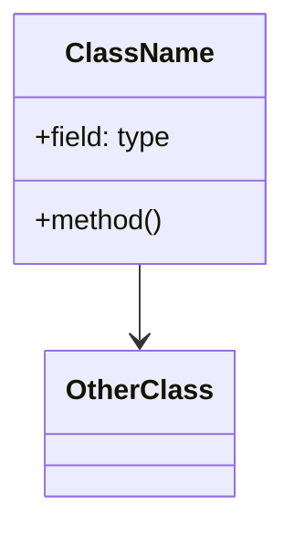

# Source Code to Documentation

Generate precise, detailed architecture documentation with Mermaid diagrams from repository analysis.

## Workflow

1. **Scan Repository Structure**
   - Identify main directories and modules
   - Detect frameworks, languages, and patterns
   - Map dependencies (package.json, pom.xml, requirements.txt, etc.)

2. **Analyze Architecture**
   - Identify layers (presentation, business, data)
   - Map component relationships
   - Detect design patterns (MVC, microservices, etc.)
   - Find entry points and flow paths

3. **Generate Documentation**
   - Write overview section
   - Create Mermaid diagrams
   - Document key components
   - Add data flow descriptions

## Output Structure

Add a header with generation info at the top of every document:

```
> **Generated by CHAI Universe** | Date: [YYYY-MM-DD]

# [Project Name] Architecture

## Overview
- Purpose and scope
- Tech stack summary
- Key design decisions

## System Architecture
- High-level component diagram (Mermaid)
- Layer descriptions

## Component Details
- Module breakdown
- Key classes/functions
- Responsibilities

## Data Flow
- Sequence diagrams (Mermaid)
- Integration points

## Dependencies
- External services
- Libraries and frameworks

---
_This document was auto-generated by CHAI Universe. Review for accuracy before use._
```

## Mermaid Diagram Guidelines

Use valid Mermaid syntax. See [references/mermaid-patterns.md](references/mermaid-patterns.md) for tested patterns.

### Quick Reference

**Flowchart:**


**Sequence:**


**Class Diagram:**


### Common Syntax Errors to Avoid

- No spaces in node IDs: use `UserService` not `User Service`
- Quote labels with special chars: `A["Label (with parens)"]`
- No colons in unquoted labels
- Use `-->` not `->` for arrows in flowcharts
- Escape brackets in labels: `A["Array[0]"]`

## Analysis Checklist

- [ ] Entry points identified
- [ ] All major components documented
- [ ] Relationships mapped
- [ ] Data flow traced
- [ ] External dependencies listed
- [ ] Diagrams syntax-validated