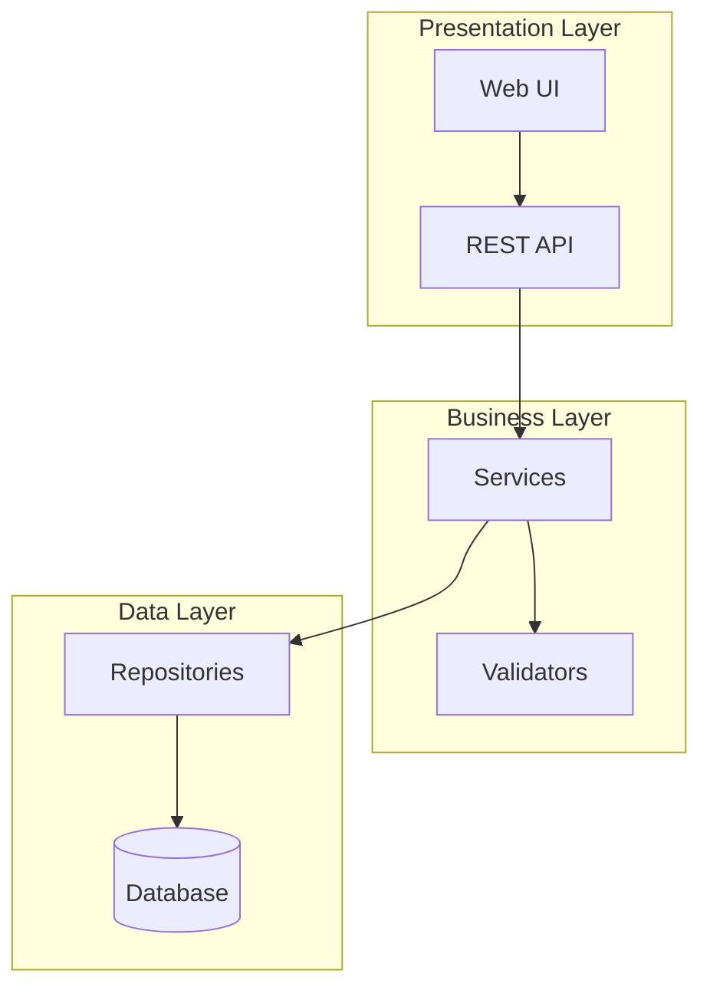
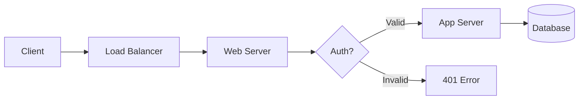
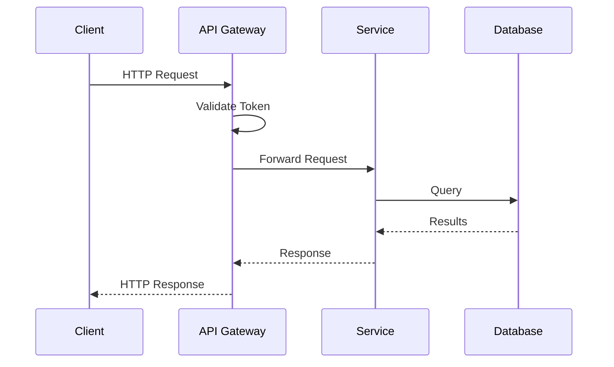
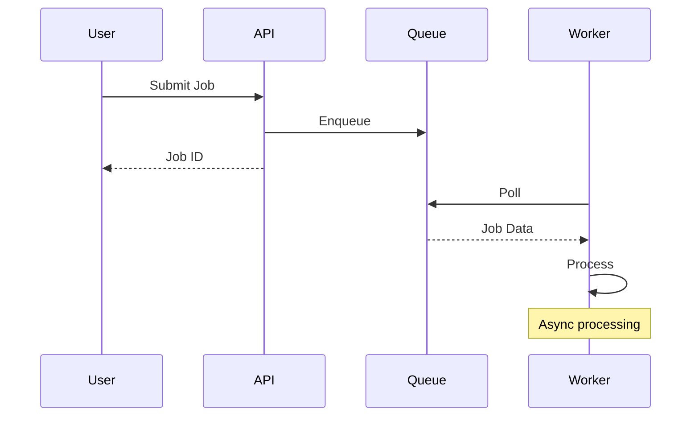
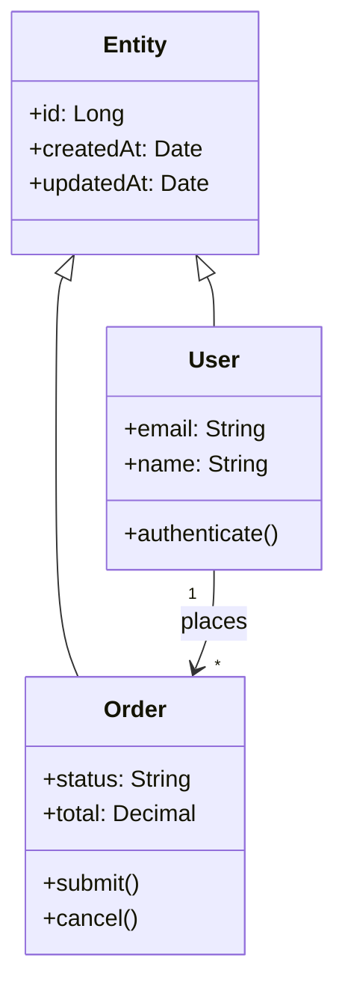
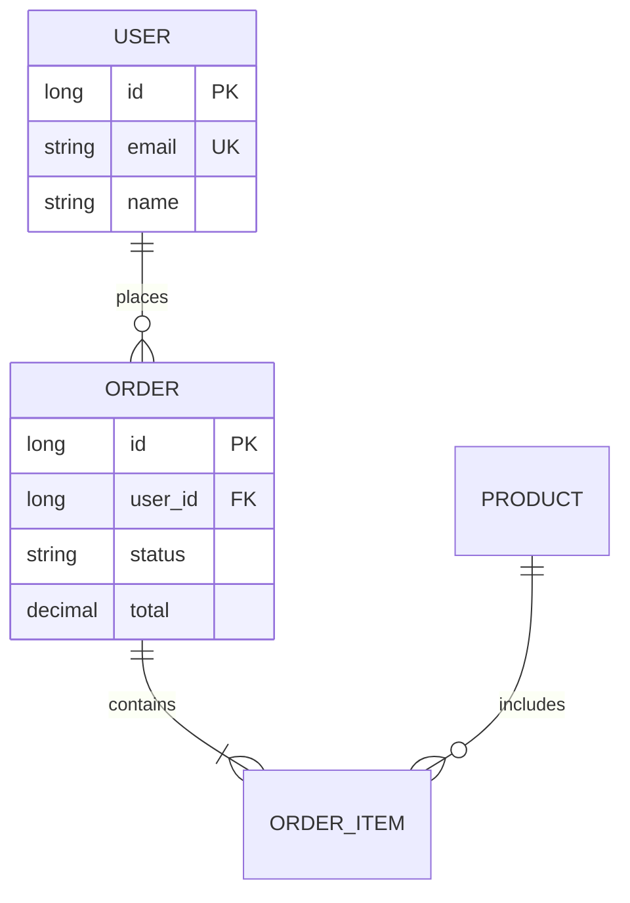
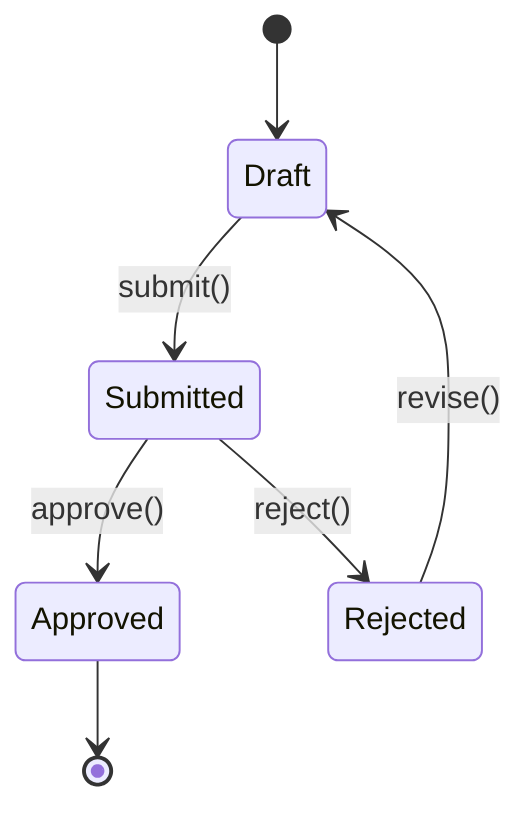
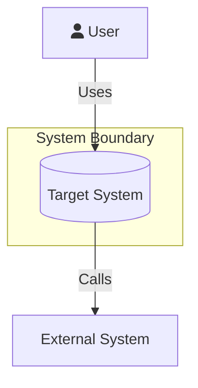

# Mermaid Diagram Patterns

Tested patterns for architecture documentation. Copy and modify these.

## Flowchart - System Architecture

## Flowchart - Request Flow

## Sequence - API Call

## Sequence - Async Processing

## Class Diagram - Domain Model

## ER Diagram - Database Schema

## State Diagram - Lifecycle

## C4 Context (using flowchart)

## Common Fixes

| Error | Fix |
|-------|-----|
| `Parse error` on spaces | Use camelCase: `UserService` not `User Service` |
| `Invalid syntax` on special chars | Quote the label: `A["Label: text"]` |
| `Unexpected token` | Check arrow syntax: `-->` for flowchart, `->>` for sequence |
| `Unknown diagram type` | Use lowercase: `flowchart` not `Flowchart` |
| Brackets not rendering | Escape in quotes: `A["data[0]"]` |
