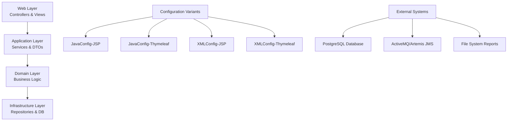
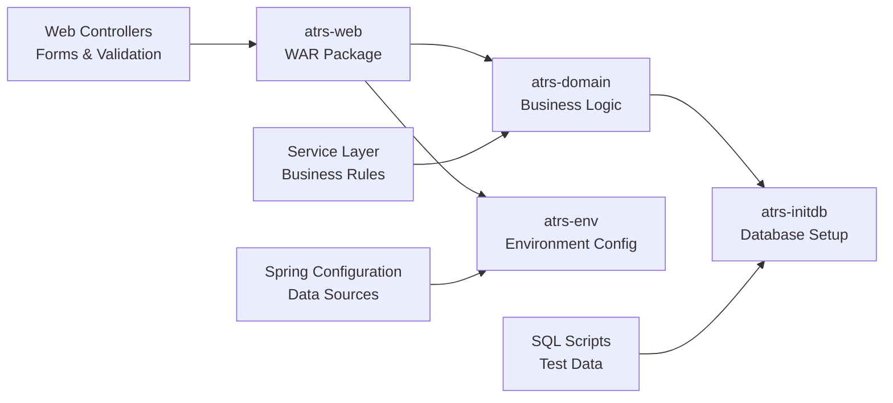
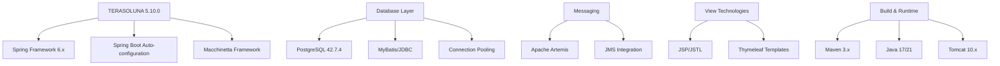
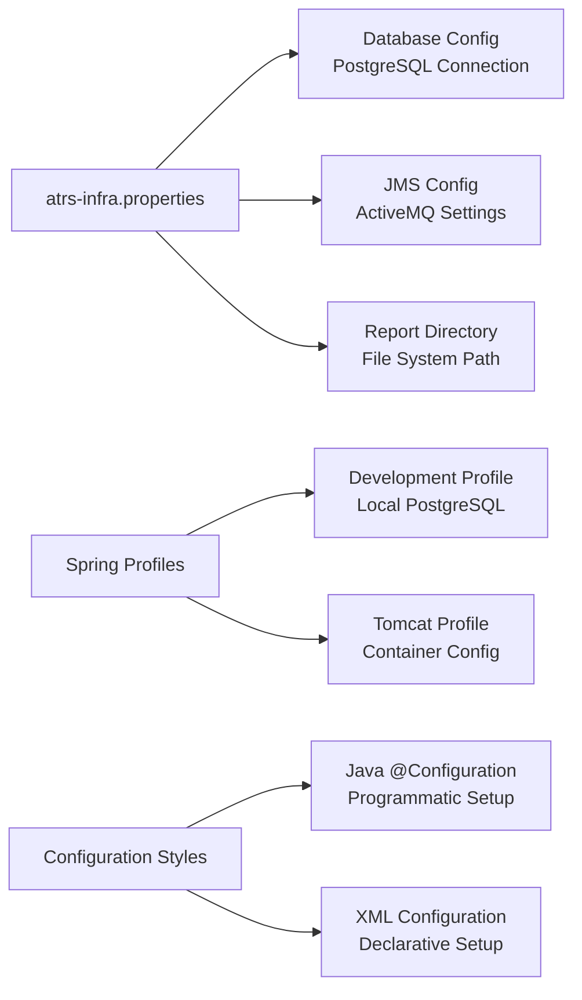

## Architecture

ATRS (Airline Ticket Reservation System) is a Spring-based enterprise Java application demonstrating TERASOLUNA Server Framework for Java (5.x). The system implements a layered architecture with multiple deployment variants.

The system provides four architectural variants combining configuration styles (Java/XML) with view technologies (JSP/Thymeleaf), all sharing the same business domain and data model.

## Modules

Each variant contains four core Maven modules with distinct responsibilities:

**atrs-web**: Web presentation layer containing controllers (b1-flight search, b2-reservation, c0/c2-member management, d1-reports), form objects, validators, and view templates. Implements MVC pattern with Spring Web MVC.

**atrs-domain**: Core business domain containing services, entities, repositories, and business logic. Houses the airline reservation business rules, member management, and flight operations.

**atrs-env**: Environment-specific configuration module managing database connections, JMS settings, and infrastructure beans. Contains Spring configuration and properties files.

**atrs-initdb**: Database initialization module with PostgreSQL schema definitions and test data population scripts for members, flights, routes, and reservations.

## Dependencies

Core technology stack built on TERASOLUNA Server Framework 5.10.0.RELEASE:

Key dependencies include PostgreSQL driver, MapStruct for object mapping, validation frameworks, and logging via Logback. The build uses Maven with Cargo plugin for deployment and Failsafe/Surefire for testing.

## Configuration

Environment configuration managed through properties and Spring profiles:

Database connection defaults to `localhost:5432/atrs` with `postgres/postgres` credentials. JMS uses localhost:61616 for message queuing. Report generation writes to `/atrs/reports/reservation` directory.

Java variants use `@Configuration` classes while XML variants use traditional Spring XML files. Container deployment configurations provided for Tomcat 10 with PostgreSQL.

## Risks

Several technical debt and modernization concerns identified:

**Legacy Framework Dependencies**: Built on older TERASOLUNA/Macchinetta stack that may have limited long-term support. Spring 6.x provides modern features but framework wrapper adds abstraction layers.

**Multiple Configuration Variants**: Four separate codebases (4 × ~78K LOC) create maintenance overhead and potential feature drift between variants. Consider consolidating to single modern approach.

**View Technology Fragmentation**: Supporting both JSP and Thymeleaf increases complexity. JSP is legacy technology with security considerations; Thymeleaf is more modern but requires different skillsets.

**Database Configuration**: Hardcoded development database credentials in properties files pose security risks. Missing environment-specific configuration management.

**Monolithic Architecture**: Single WAR deployment model limits scalability and cloud-native adoption. Consider microservices decomposition for better maintainability.

**Limited Test Coverage**: Database initialization scripts suggest integration testing setup, but test coverage across business logic modules needs assessment for production readiness.

🦉