# ATRS Architecture Documentation

> **Generated by CHAI Universe** | Date: 2026-01-14

---

## Table of Contents

1. [Overview](#overview)
2. [System Architecture](#system-architecture)
3. [Module Structure](#module-structure)
4. [Component Details](#component-details)
5. [Data Model](#data-model)
6. [Data Flow](#data-flow)
7. [Security Architecture](#security-architecture)
8. [Design Patterns](#design-patterns)
9. [Dependencies](#dependencies)
10. [Deployment](#deployment)
11. [Assessment & Recommendations](#assessment--recommendations)

---

## Overview

### Purpose and Scope

**ATRS (Airline Ticket Reservation System)** is a sample application demonstrating enterprise Java web application development using modern Spring Framework technologies. The system provides:

- **Flight Search** - Search for available flights by route, date, and class
- **Ticket Reservation** - Book flights with passenger information
- **Member Management** - Register and manage customer accounts
- **Authentication** - Secure login/logout functionality
- **Reservation History** - Generate CSV reports of past bookings

### Tech Stack Summary

| Layer | Technology | Version |
|-------|-----------|---------|
| **Language** | Java | 17 |
| **Framework** | TERASOLUNA Framework (Spring-based) | 5.10.0 |
| **Web MVC** | Spring MVC | 6.x |
| **Security** | Spring Security | 6.x |
| **ORM** | MyBatis | 3.x |
| **Object Mapping** | MapStruct | 1.x |
| **View** | JSP + JSTL | Jakarta EE |
| **Database** | PostgreSQL | 42.7.4 (driver) |
| **Messaging** | Apache Artemis (JMS) | ActiveMQ Artemis |
| **Build** | Maven | 3.x |
| **Server** | Tomcat (via Cargo) | 10.x |

### Key Design Decisions

1. **Feature-Based Packaging** - Code organized by business feature (a0-a2, b0-b2, c0-c2, d1)
2. **Layered Architecture** - Clear separation: Web → Service → Repository → Database
3. **Dual Interface** - Both REST API (JSON) and traditional MVC (JSP) interfaces
4. **Security-First** - CSRF protection, transaction tokens, input validation
5. **Java Configuration** - Uses `@Configuration` classes instead of XML
6. **Master Data Caching** - In-memory caching of reference data with `@PostConstruct`
7. **Optimistic Locking** - For concurrent access (MyBatis `FOR UPDATE`)

---

## System Architecture

### High-Level Architecture

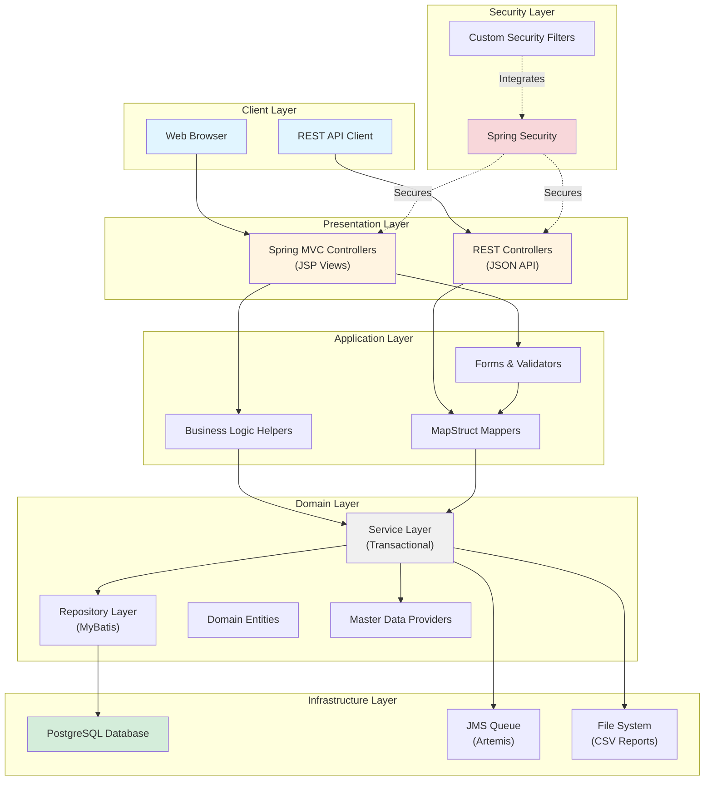

### Module Architecture

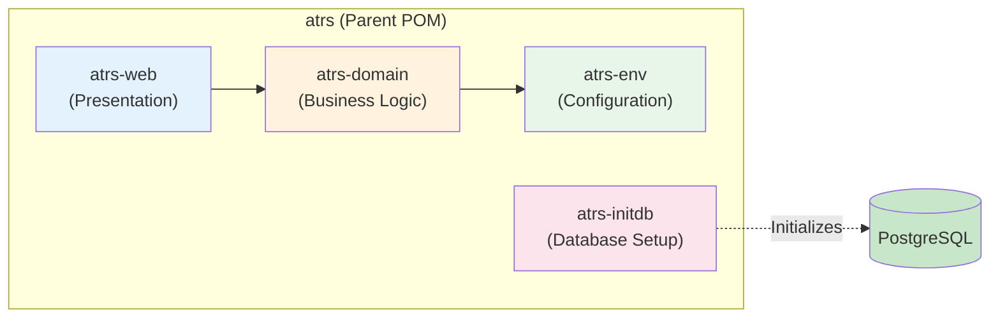

---

## Module Structure

### 1. atrs-env (Environment Configuration)

**Purpose**: Centralized configuration and infrastructure beans

```
atrs-env/
├── src/main/java/
│   └── jp/co/ntt/atrs/
│       ├── app/ExtendedActiveMQConnectionFactory.java
│       └── config/app/
│           └── AtrsEnvConfig.java          → Infrastructure beans
├── src/main/resources/
│   ├── META-INF/spring/
│   │   └── atrs-infra.properties          → Configuration properties
│   └── logback.xml                        → Logging configuration
└── configs/tomcat10-postgresql/           → Container configs
```

**Key Responsibilities**:
- Database connection pools
- JMS connection factories
- Transaction management
- Property file loading

### 2. atrs-domain (Business Domain)

**Purpose**: Core business logic and data access

```
atrs-domain/
├── src/main/java/jp/co/ntt/atrs/domain/
│   ├── model/                             → Domain entities
│   │   ├── Member.java
│   │   ├── Reservation.java
│   │   ├── Flight.java
│   │   ├── Route.java
│   │   └── (13 entity classes total)
│   ├── repository/                        → MyBatis repositories
│   │   ├── member/
│   │   │   ├── MemberRepository.java
│   │   │   └── MemberRepository.xml       → SQL mappings
│   │   ├── flight/
│   │   ├── reservation/
│   │   └── (7 repository packages)
│   ├── service/                           → Business services
│   │   ├── a0/ - a2/                     → Authentication
│   │   ├── b0/ - b2/                     → Ticket management
│   │   ├── c0/ - c2/                     → Member management
│   │   └── d1/                           → Reporting
│   └── common/                           → Shared utilities
│       ├── codelist/                     → Dropdown lists
│       ├── logging/                      → Log messages
│       ├── masterdata/                   → Data providers
│       ├── message/                      → Message keys
│       ├── util/                         → Helper utilities
│       └── validate/                     → Custom validators
└── src/main/resources/
    └── jp/co/ntt/atrs/domain/
        └── repository/                   → MyBatis XML mappers
```

**Service Package Organization**:

| Package | Feature | Components |
|---------|---------|------------|
| **a0** | Membership Shared | `MembershipSharedService` |
| **a1** | Login | `AuthLoginService`, `AtrsUserDetailsService`, `AuthLoginErrorCode` |
| **a2** | Logout | `AuthLogoutService` |
| **b0** | Ticket Shared | `TicketSharedService`, `InvalidFlightException` |
| **b1** | Ticket Search | `TicketSearchService`, `TicketSearchCriteriaDto`, `FlightVacantInfoDto` |
| **b2** | Ticket Reserve | `TicketReserveService`, `TicketReserveDto` |
| **c0** | Member Shared | `MemberErrorCode` |
| **c1** | Member Register | `MemberRegisterService` |
| **c2** | Member Update | `MemberUpdateService` |
| **d1** | History Report | `ReservationHistoryReportService` |

### 3. atrs-web (Presentation Layer)

**Purpose**: Web interface (MVC + REST API)

```
atrs-web/
├── src/main/java/jp/co/ntt/atrs/
│   ├── api/                              → REST API layer
│   │   ├── common/error/                 → API exception handling
│   │   ├── flight/
│   │   │   ├── FlightRestController.java
│   │   │   ├── FlightResource.java       → Response DTO
│   │   │   ├── FlightValidator.java
│   │   │   └── FlightMapper.java         → MapStruct
│   │   └── ticket/
│   │       ├── TicketRestController.java
│   │       └── TicketReserveResource.java
│   ├── app/                              → MVC layer
│   │   ├── a0/ - a1/                    → Top & auth
│   │   ├── b0/ - b2/                    → Ticket features
│   │   ├── c0/ - c2/                    → Member features
│   │   ├── d1/                          → Reports
│   │   └── common/                      → Web utilities
│   │       ├── exception/               → Custom exceptions
│   │       ├── filter/                  → Servlet filters
│   │       ├── interceptor/             → Spring interceptors
│   │       ├── security/                → Security components
│   │       └── util/                    → Web helpers
│   ├── config/                          → Spring configuration
│   │   ├── app/
│   │   │   ├── ApplicationContextConfig.java
│   │   │   └── AtrsDomainConfig.java
│   │   └── web/
│   │       ├── SpringMvcConfig.java     → MVC setup
│   │       ├── SpringMvcRestConfig.java → REST setup
│   │       └── SpringSecurityConfig.java → Security setup
│   └── listener/                        → JMS listeners
│       └── common/error/
├── src/main/webapp/
│   └── WEB-INF/
│       ├── views/                       → JSP pages
│       │   ├── A0/ - A1/               → Auth views
│       │   ├── B1/ - B2/               → Ticket views
│       │   ├── C1/ - C2/               → Member views
│       │   ├── D1/                     → Report views
│       │   └── common/error/           → Error pages
│       └── web.xml                     → Web app descriptor
└── src/main/resources/
    └── i18n/                           → Internationalization
        ├── atrs-messages.properties    → Messages
        └── atrs-fields.properties      → Field labels
```

### 4. atrs-initdb (Database Initialization)

**Purpose**: Database schema and seed data

```
atrs-initdb/
├── src/sqls/integration-test-postgres/
│   ├── 00000_drop_all_tables.sql
│   ├── 00100_create_all_tables.sql      → DDL
│   ├── 00200_insert_fixed_value.sql     → Master data
│   ├── 00210_insert_route.sql           → Routes
│   ├── 00220_insert_flight_master.sql   → Flight templates
│   ├── 00230_insert_member.sql          → Test members
│   ├── 00240_insert_peak_time.sql       → Peak periods
│   └── 00250_insert_flight.sql          → Available flights
└── pom.xml                              → SQL execution config
```

---

## Component Details

### Domain Entities

#### Core Business Entities

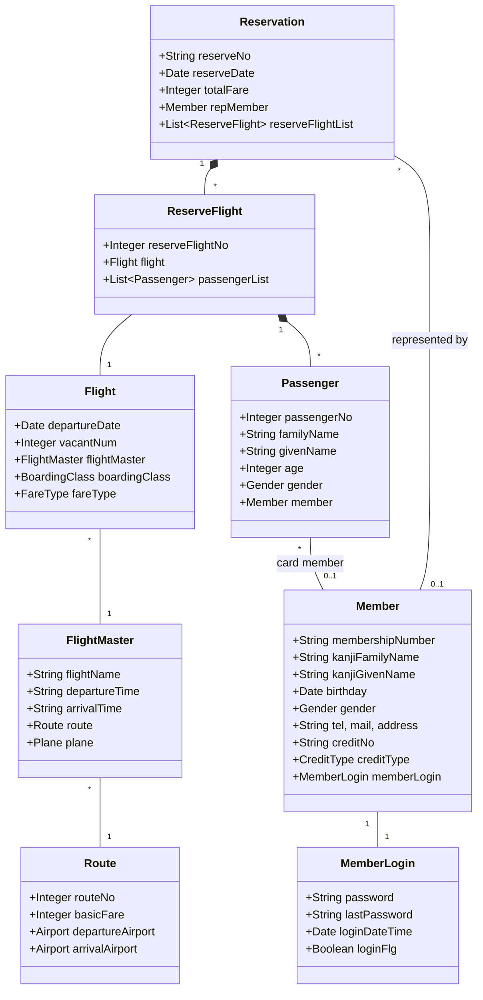

#### Database Schema

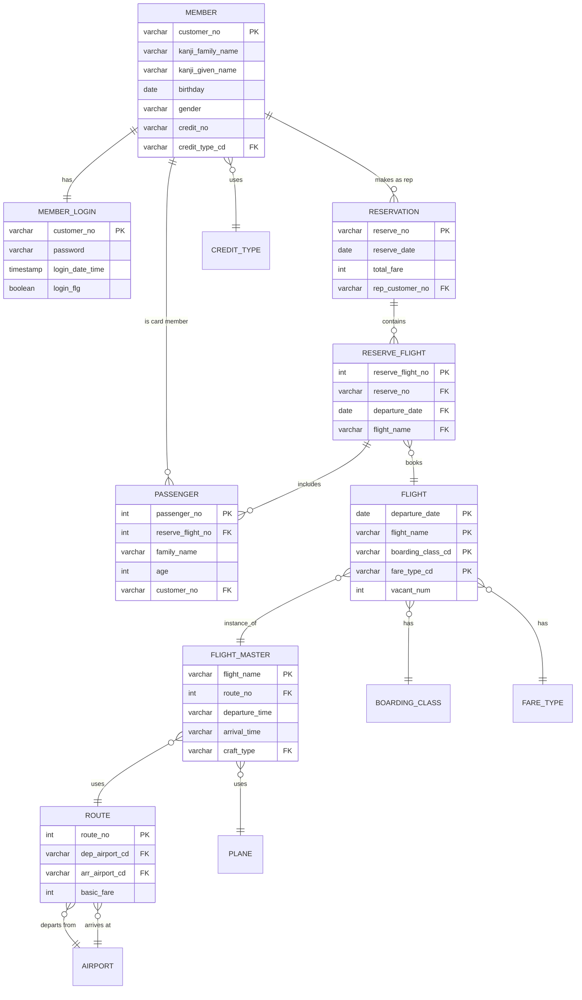

### Service Layer Architecture

#### Service Flow Pattern

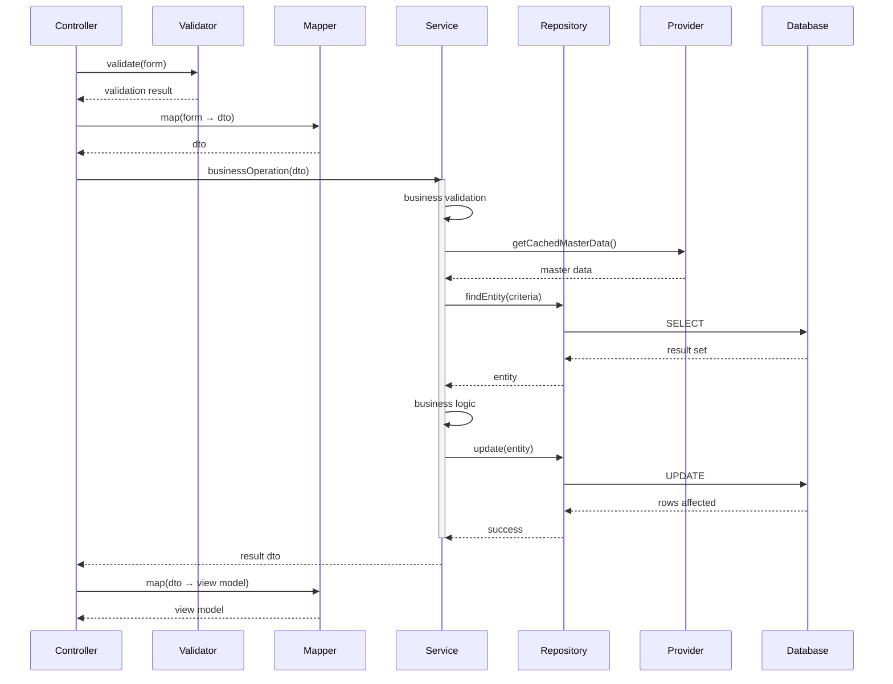

#### Transaction Management

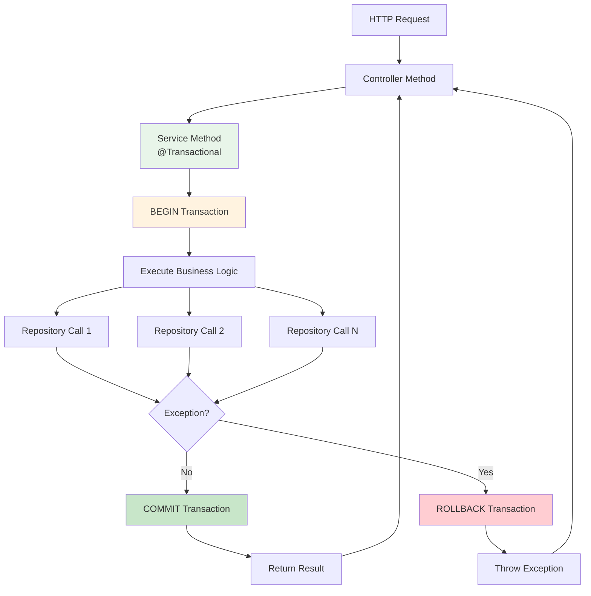

### Web Layer Architecture

#### Request Processing Flow (MVC)

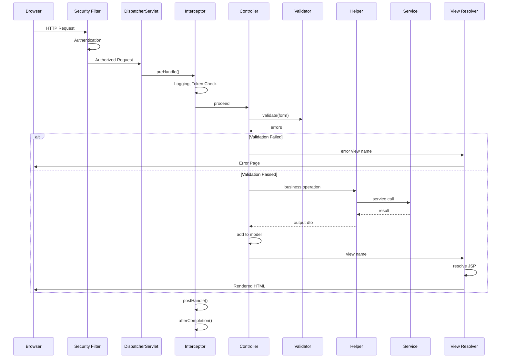

#### REST API Flow

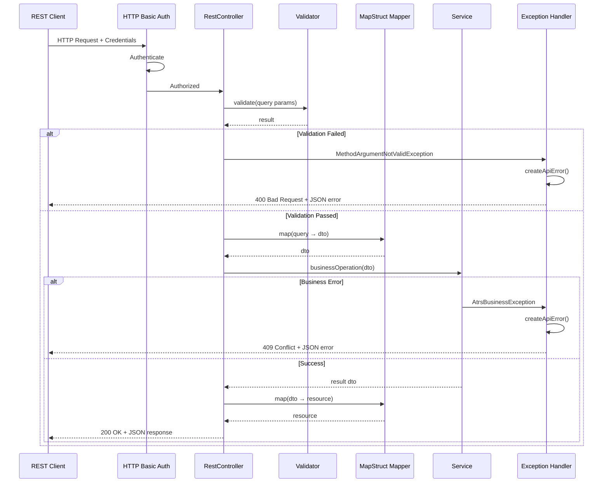

---

## Data Flow

### Use Case 1: Flight Search

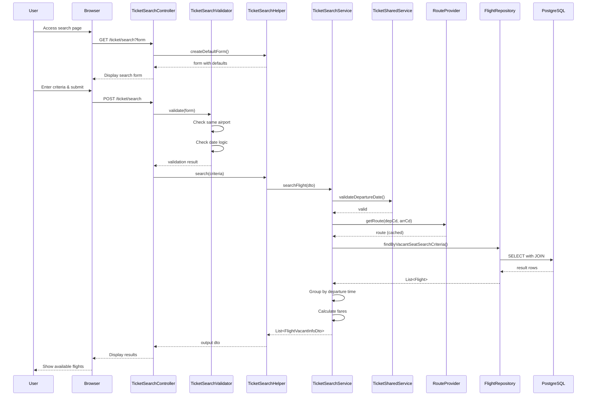

### Use Case 2: Ticket Reservation

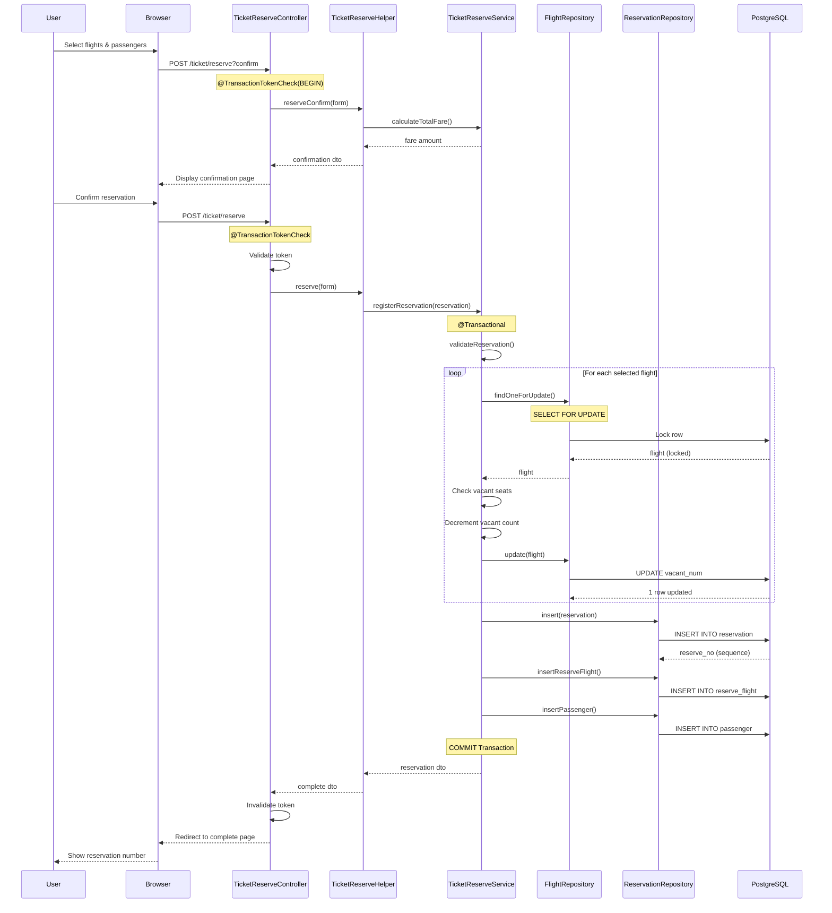

### Use Case 3: Member Registration

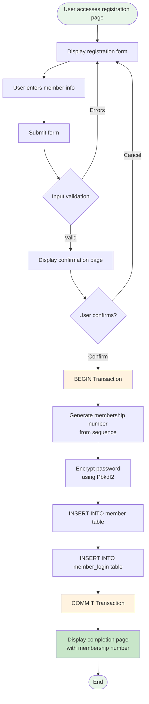

---

## Security Architecture

### Authentication Flow

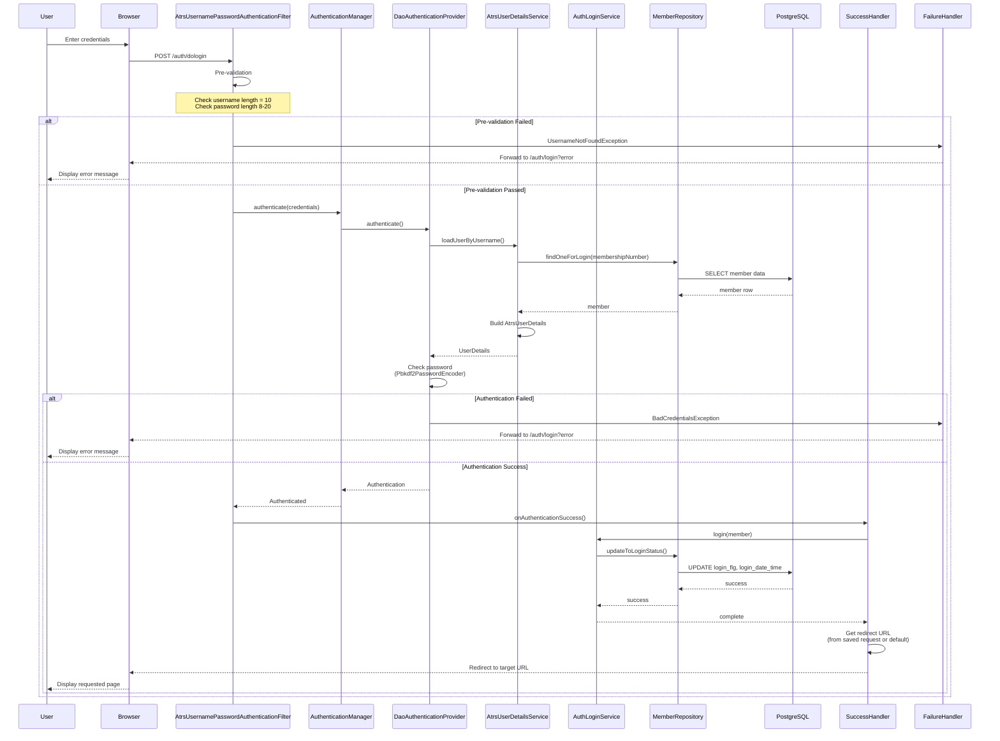

### Authorization Model

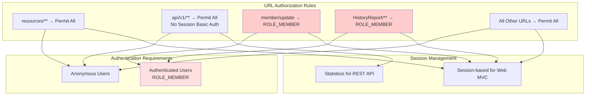

### Security Mechanisms

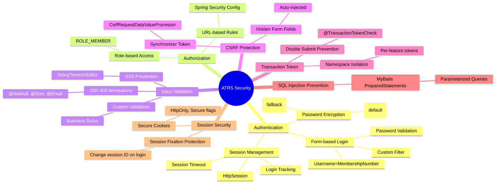

---

## Design Patterns

### 1. Layered Architecture Pattern

```
┌─────────────────────────────────────────────┐
│         Presentation Layer                   │
│  (Controllers, Forms, Views, Validators)    │
└────────────────┬────────────────────────────┘
                 │
┌────────────────▼────────────────────────────┐
│         Application Layer                    │
│        (Helpers, Mappers)                   │
└────────────────┬────────────────────────────┘
                 │
┌────────────────▼────────────────────────────┐
│         Domain Layer                         │
│     (Services, Entities, Repositories)      │
└────────────────┬────────────────────────────┘
                 │
┌────────────────▼────────────────────────────┐
│         Infrastructure Layer                 │
│    (Database, JMS, File System)             │
└─────────────────────────────────────────────┘
```

**Benefits**:
- Clear separation of concerns
- Independent layer testing
- Easy to replace infrastructure

### 2. Repository Pattern

```java
// Interface
public interface MemberRepository {
    Member findOne(String membershipNumber);
    void insert(Member member);
    void update(Member member);
}

// MyBatis XML Implementation
// MemberRepository.xml contains SQL mappings
```

**Benefits**:
- Abstracts data access logic
- Centralizes query management
- Simplifies testing with mocks

### 3. Service Layer Pattern

```java
@Service
@Transactional
public class TicketReserveServiceImpl implements TicketReserveService {
    @Inject
    FlightRepository flightRepository;
    
    @Override
    public TicketReserveDto registerReservation(Reservation reservation) {
        // Business logic here
        // All repository calls in one transaction
    }
}
```

**Benefits**:
- Encapsulates business logic
- Manages transactions declaratively
- Reusable across multiple controllers

### 4. DTO (Data Transfer Object) Pattern

```java
// Domain entity
public class Flight { ... }

// Service layer DTO
public class FlightVacantInfoDto { ... }

// REST API resource
public class FlightResource { ... }

// Mapping with MapStruct
@Mapper
public interface FlightMapper {
    FlightResource map(FlightVacantInfoDto dto);
}
```

**Benefits**:
- Decouples layers
- Controls data exposure
- Type-safe transformations

### 5. Provider Pattern (Cache Pattern)

```java
@Component
public class RouteProvider {
    @Inject
    RouteRepository routeRepository;
    
    private Map<String, Route> routeMap = new HashMap<>();
    
    @PostConstruct
    public void load() {
        List<Route> routes = routeRepository.findAll();
        for (Route route : routes) {
            routeMap.put(makeKey(route), route);
        }
    }
    
    public Route getRoute(String depCd, String arrCd) {
        return routeMap.get(makeKey(depCd, arrCd));
    }
}
```

**Benefits**:
- Improves performance (in-memory access)
- Reduces database load
- Simple implementation

### 6. Template Method Pattern (MyBatis)

MyBatis uses templates for SQL:
- XML files define SQL templates
- Parameters injected safely
- Results mapped to objects automatically

### 7. Front Controller Pattern

Spring MVC's `DispatcherServlet` acts as front controller:
- Single entry point for requests
- Routes to appropriate handlers
- Manages common concerns (security, logging)

### 8. Post-Redirect-Get (PRG) Pattern

```java
@RequestMapping(method = POST)
public String reserve(TicketReserveForm form, RedirectAttributes attrs) {
    // Process form
    TicketReserveDto result = service.reserve(form);
    
    // Add to flash attributes
    attrs.addFlashAttribute("result", result);
    
    // Redirect (not forward)
    return "redirect:/ticket/reserve?complete";
}

@RequestMapping(method = GET, params = "complete")
public String reserveComplete() {
    // Flash attributes available in model
    return "B2/reserveComplete";
}
```

**Benefits**:
- Prevents duplicate form submissions
- Enables browser back button safety
- Clean URLs after POST

### 9. Transaction Token Pattern

```java
@TransactionTokenCheck(type = TransactionTokenType.BEGIN)
public String confirm() {
    // Token created and stored in session
    return "confirmPage";
}

@TransactionTokenCheck
public String submit() {
    // Token validated and consumed
    return "redirect:/complete";
}
```

**Benefits**:
- Prevents double submission
- Protects against replay attacks
- Namespace isolation

### 10. Dependency Injection Pattern

```java
@Controller
public class TicketSearchController {
    @Inject  // Jakarta Inject
    TicketSearchService service;
    
    @Inject
    TicketSearchHelper helper;
}
```

**Benefits**:
- Loose coupling
- Easy testing (mock injection)
- Centralized configuration

---

## Dependencies

### Core Framework Dependencies

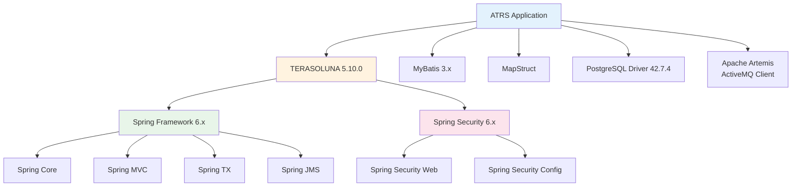

### Maven Dependency Tree

```xml
atrs (Parent)
├── atrs-env
│   ├── spring-context
│   ├── spring-jms
│   ├── artemis-jakarta-client
│   └── logback
├── atrs-domain
│   ├── atrs-env
│   ├── terasoluna-gfw-common
│   ├── terasoluna-gfw-security-core
│   ├── terasoluna-gfw-mybatis3
│   ├── spring-jms
│   └── artemis-jakarta-client
├── atrs-web
│   ├── atrs-domain
│   ├── terasoluna-gfw-web
│   ├── terasoluna-gfw-security-web
│   ├── spring-webmvc
│   ├── spring-security-web
│   ├── spring-security-config
│   ├── jsp-api
│   ├── jstl
│   └── mapstruct
└── atrs-initdb
    └── postgresql (driver)
```

### External Services

| Service | Purpose | Configuration |
|---------|---------|---------------|
| **PostgreSQL** | Primary database | `atrs-infra.properties` |
| **Apache Artemis** | JMS messaging (reports) | `AtrsEnvConfig.java` |
| **File System** | CSV report storage | `application.properties` |

---

## Deployment

### Build Process

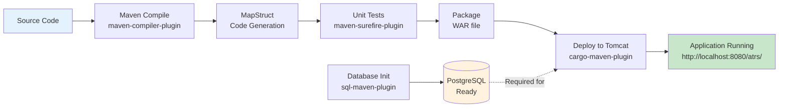

### Deployment Architecture

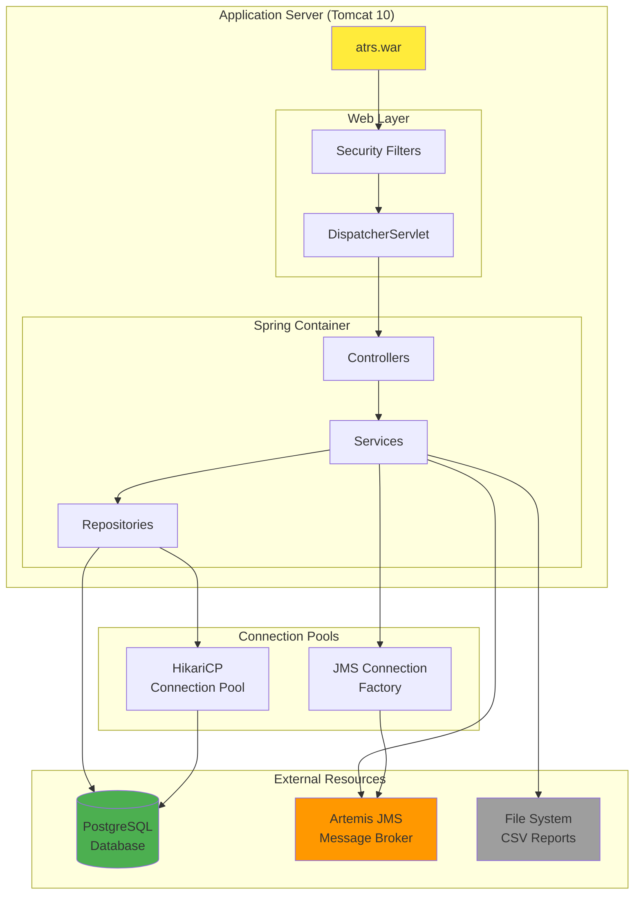

### Environment Configuration

```properties
# atrs-infra.properties

# Database
database.url=jdbc:postgresql://localhost:5432/atrs
database.username=postgres
database.password=postgres
database.driverClassName=org.postgresql.Driver

# Connection Pool
cp.maxActive=96
cp.maxIdle=16
cp.minIdle=0
cp.maxWait=60000

# JMS
jms.url=tcp://localhost:61616
jms.username=admin
jms.password=admin

# Application
atrs.reserveIntervalTime=30
default.flightType=RT
```

### Build Commands

```bash
# Navigate to project
cd JavaConfig-JSP/atrs/

# Build all modules
mvn clean install

# Initialize database
mvn sql:execute -f atrs-initdb/pom.xml

# Run application
mvn cargo:run -pl atrs-web

# Application accessible at:
# http://localhost:8080/atrs/
```

### Runtime Requirements

| Component | Version | Notes |
|-----------|---------|-------|
| **JDK** | 17+ | Java 17 or higher required |
| **Maven** | 3.6+ | Build tool |
| **PostgreSQL** | 13+ | Database server |
| **Tomcat** | 10.x | Jakarta EE 9+ compatible |
| **Memory** | 512MB+ | Recommended heap size |

---

## Assessment & Recommendations

### Architectural Strengths

✅ **Well-Structured Layering**
- Clear separation between web, service, and data layers
- Dependency flow is unidirectional (top to bottom)

✅ **Feature-Based Organization**
- Code organized by business feature (a0-d1)
- Easy to locate and modify feature-specific code

✅ **Strong Security Posture**
- CSRF protection enabled
- Transaction tokens prevent double submission
- Input validation at multiple levels
- SQL injection prevention via MyBatis

✅ **Comprehensive Validation**
- JSR-303 bean validation
- Custom business validators
- Pre-validation in security filters

✅ **Transaction Management**
- Declarative transactions via `@Transactional`
- Proper rollback on exceptions
- Pessimistic locking for critical operations

✅ **Performance Optimization**
- Master data caching via Providers
- Connection pooling (HikariCP)
- Efficient MyBatis mappings

✅ **Testability**
- Dependency injection throughout
- Clear interfaces for services and repositories
- Separation of concerns enables unit testing

✅ **Type Safety**
- MapStruct for compile-time DTO mapping
- Strong typing with enums
- No magic strings

### Areas for Improvement

⚠️ **Configuration Management**
- Properties hardcoded in `atrs-infra.properties`
- **Recommendation**: Use environment variables or Spring Cloud Config for production

⚠️ **Exception Handling**
- Some business exceptions caught and re-thrown
- **Recommendation**: Standardize exception hierarchy and error codes

⚠️ **API Versioning**
- REST API uses `/api/v1/` prefix but no formal versioning strategy
- **Recommendation**: Document API versioning and deprecation policy

⚠️ **Logging**
- Logging uses logback but configuration may need tuning
- **Recommendation**: Implement structured logging (JSON format) for production

⚠️ **Monitoring & Observability**
- No application performance monitoring (APM) integration
- **Recommendation**: Add Spring Boot Actuator or similar for health checks

⚠️ **Database Migrations**
- SQL scripts manually numbered and executed
- **Recommendation**: Use Flyway or Liquibase for version-controlled migrations

⚠️ **Async Processing**
- JMS used for report generation but limited async patterns
- **Recommendation**: Consider `@Async` for long-running operations

⚠️ **Caching Strategy**
- Master data cached in memory but no expiration strategy
- **Recommendation**: Add cache invalidation mechanism or use Spring Cache abstraction

⚠️ **API Documentation**
- No Swagger/OpenAPI documentation for REST APIs
- **Recommendation**: Add Springdoc OpenAPI for interactive API docs

⚠️ **Internationalization**
- Message properties exist but limited language support
- **Recommendation**: Expand i18n support for multiple locales

### Modernization Opportunities

🔄 **Spring Boot Migration**
- Consider migrating to Spring Boot for:
  - Auto-configuration
  - Embedded server (no WAR deployment)
  - Simplified property management
  - Better DevOps integration

🔄 **API-First Development**
- Expand REST API coverage
- Consider GraphQL for flexible data queries
- Implement HATEOAS for discoverability

🔄 **Frontend Modernization**
- JSP views could be replaced with:
  - Thymeleaf (already has variant in repo)
  - React/Vue.js SPA
  - Server-Side Rendering (SSR) frameworks

🔄 **Cloud-Native Patterns**
- Externalize configuration (12-factor app)
- Add health checks and readiness probes
- Containerize with Docker
- Implement circuit breakers (Resilience4j)

🔄 **Event-Driven Architecture**
- Expand JMS usage for decoupling
- Consider event sourcing for audit trails
- Implement CQRS for read-heavy operations

🔄 **Microservices Decomposition**
- Potential service boundaries:
  - Member Service (a0-a2, c0-c2)
  - Flight Service (b0-b1)
  - Reservation Service (b2)
  - Report Service (d1)

### Security Enhancements

🔒 **Enhanced Authentication**
- Add multi-factor authentication (MFA)
- Implement OAuth2/OIDC for SSO
- Support API keys for REST clients

🔒 **Audit Logging**
- Track all data modifications
- Log authentication events
- Implement immutable audit trails

🔒 **Rate Limiting**
- Add rate limiting for REST APIs
- Prevent brute-force login attempts
- Throttle expensive operations

🔒 **Secrets Management**
- Use HashiCorp Vault or AWS Secrets Manager
- Rotate credentials regularly
- Never commit secrets to version control

### Performance Recommendations

⚡ **Database Optimization**
- Add database connection pool monitoring
- Implement query result caching (Redis)
- Add database indexes based on query patterns
- Use database connection pool tuning

⚡ **Response Time**
- Add CDN for static resources
- Implement HTTP caching headers
- Enable GZIP compression
- Consider pagination for large result sets

⚡ **Scalability**
- Externalize session state (Redis)
- Make application stateless
- Add horizontal scaling capability
- Implement database read replicas

### Development Workflow

🛠️ **Continuous Integration**
- Set up CI pipeline (GitHub Actions, Jenkins)
- Run tests on every commit
- Automated code quality checks (SonarQube)
- Automated security scanning (OWASP Dependency-Check)

🛠️ **Development Environment**
- Use Docker Compose for local dependencies
- Add development profiles
- Hot reload for faster development
- Integration test containers (Testcontainers)

🛠️ **Documentation**
- Add architectural decision records (ADRs)
- Document API contracts (OpenAPI)
- Create developer onboarding guide
- Maintain changelog (Keep a Changelog format)

### Compliance & Governance

📋 **Data Privacy**
- Implement GDPR compliance features
- Add data retention policies
- Provide data export functionality
- Implement right-to-be-forgotten

📋 **Regulatory Compliance**
- PCI-DSS for credit card handling
- Audit trail for financial transactions
- Data encryption at rest and in transit

---

## Conclusion

The ATRS application demonstrates a **well-architected enterprise Java application** following industry best practices:

- **Solid Foundation**: Built on proven frameworks (Spring, MyBatis, TERASOLUNA)
- **Clear Structure**: Layered architecture with feature-based organization
- **Security-Conscious**: Multiple layers of protection and validation
- **Maintainable**: Clean separation of concerns and consistent patterns
- **Extensible**: Interface-based design and dependency injection

**Maturity Assessment**: ⭐⭐⭐⭐ (4/5)

The application is production-ready with minor enhancements needed for:
- Cloud deployment
- Enhanced monitoring
- API documentation
- Configuration externalization

**Recommended Next Steps**:
1. Add Spring Boot Actuator for health checks
2. Implement centralized logging with structured logs
3. Add OpenAPI documentation for REST APIs
4. Externalize configuration for different environments
5. Set up CI/CD pipeline
6. Add database migration tool (Flyway)
7. Implement comprehensive integration tests

---

_This document was auto-generated by CHAI Universe. Review for accuracy before use._

**Generated**: 2026-01-14  
**Version**: 1.0  
**Project**: ATRS JavaConfig-JSP variant  
**Framework**: TERASOLUNA 5.10.0 / Spring 6.x
