# ATRS (Airline Ticket Reservation System) - Design Document

## Table of Contents
1. [Executive Summary](#1-executive-summary)
2. [System Overview](#2-system-overview)
3. [Architecture](#3-architecture)
4. [Module Structure](#4-module-structure)
5. [Domain Model](#5-domain-model)
6. [Service Layer](#6-service-layer)
7. [Web Layer](#7-web-layer)
8. [REST API Layer](#8-rest-api-layer)
9. [Security Architecture](#9-security-architecture)
10. [Database Design](#10-database-design)
11. [Configuration Management](#11-configuration-management)
12. [Cross-Cutting Concerns](#12-cross-cutting-concerns)
13. [Architecture Assessment](#13-architecture-assessment)

---

## 1. Executive Summary

**ATRS** is a multi-module Java/Spring web application for airline ticket reservation. Built on the TERASOLUNA framework (v5.10.0), it demonstrates enterprise-grade patterns for a transactional booking system.

| Attribute | Value |
|-----------|-------|
| Version | 1.11.0.RELEASE |
| Java | 17 |
| Framework | Spring MVC 6.x, Spring Security 6.x |
| ORM | MyBatis |
| Database | PostgreSQL |
| View | JSP |
| Messaging | ActiveMQ Artemis (JMS) |

---

## 2. System Overview

### 2.1 High-Level System Context

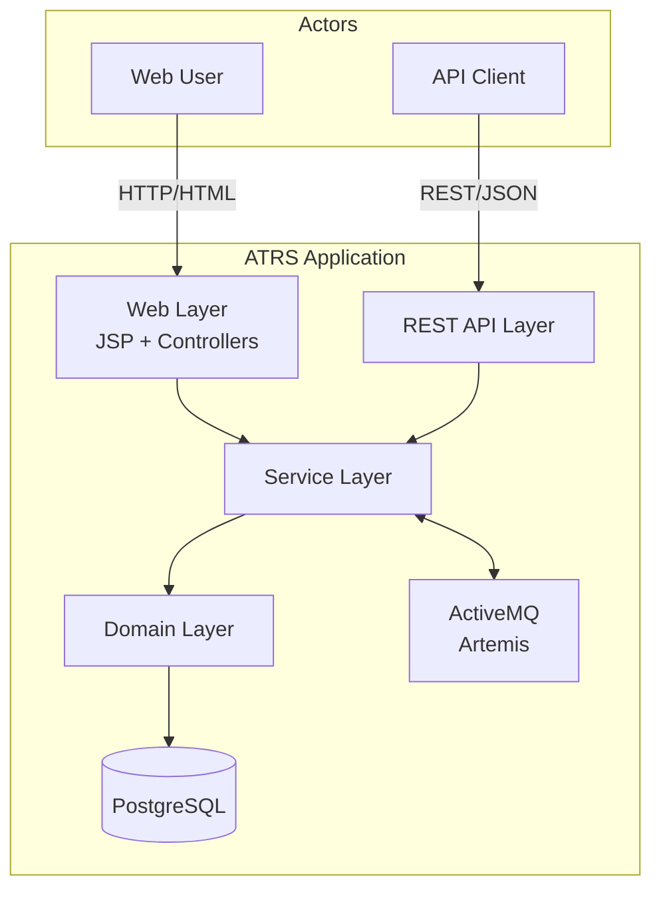

### 2.2 Core Features

| Feature Code | Feature | Description |
|--------------|---------|-------------|
| A0-A2 | Authentication | Login, logout, session management |
| B0-B2 | Ticket Operations | Flight search, fare calculation, reservation |
| C0-C2 | Member Management | Registration, profile update |
| D1 | Reporting | Async reservation history report generation |

---

## 3. Architecture

### 3.1 Layered Architecture

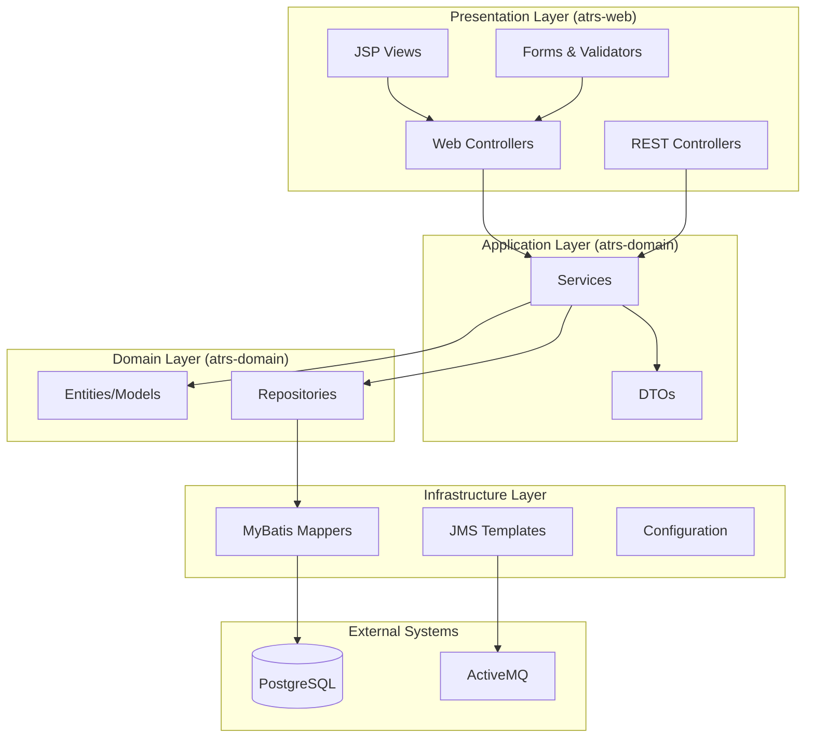

### 3.2 Module Dependencies

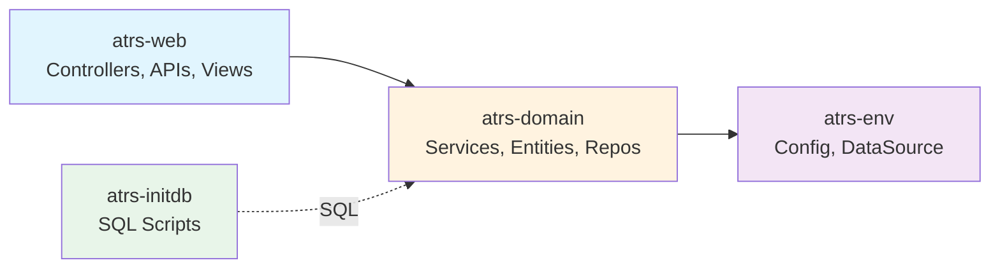

### 3.3 Package Structure

```
jp.co.ntt.atrs/
├── domain/
│   ├── model/           # Entities (Member, Flight, Reservation, etc.)
│   ├── repository/      # MyBatis mappers
│   └── service/
│       ├── a0/          # Shared authentication
│       ├── a1/          # Login
│       ├── a2/          # Logout
│       ├── b0/          # Shared ticket operations
│       ├── b1/          # Flight search
│       ├── b2/          # Reservation
│       ├── c0/          # Shared member operations
│       ├── c1/          # Member registration
│       ├── c2/          # Member update
│       └── d1/          # Reservation history report
├── app/                 # Web controllers & forms
├── api/                 # REST controllers & resources
└── config/              # Spring configuration
```

---

## 4. Module Structure

### 4.1 atrs-env (Environment Configuration)

**Purpose**: Environment-specific configurations (DataSource, JMS, logging)

| Component | Responsibility |
|-----------|----------------|
| `AtrsEnvConfig` | DataSource, TransactionManager, JMS ConnectionFactory |
| `ExtendedActiveMQConnectionFactory` | Custom JMS factory for embedded broker |
| `atrs-infra.properties` | Database connection properties |
| `logback.xml` | Logging configuration |

### 4.2 atrs-domain (Business Logic)

**Purpose**: Core business logic, entities, and data access

| Package | Contents |
|---------|----------|
| `model/` | 15+ entity classes (Member, Flight, Reservation, etc.) |
| `repository/` | MyBatis mapper interfaces |
| `service/a0-d1/` | 10 service interfaces + implementations |

### 4.3 atrs-web (Web & API Layer)

**Purpose**: Controllers, REST APIs, views, and security

| Package | Contents |
|---------|----------|
| `app/` | 7 web controllers, forms, validators |
| `api/` | 2 REST controllers, resources, mappers |
| `config/web/` | MVC, REST, Security configuration |

### 4.4 atrs-initdb (Database Initialization)

**Purpose**: SQL scripts for schema and data initialization

| Script | Purpose |
|--------|---------|
| `00000_drop_all_tables.sql` | Drop all tables |
| `00100_create_all_tables.sql` | Create schema |
| `00200-00250_insert_*.sql` | Seed data (airports, routes, flights, members) |

---

## 5. Domain Model

### 5.1 Entity Relationship Diagram

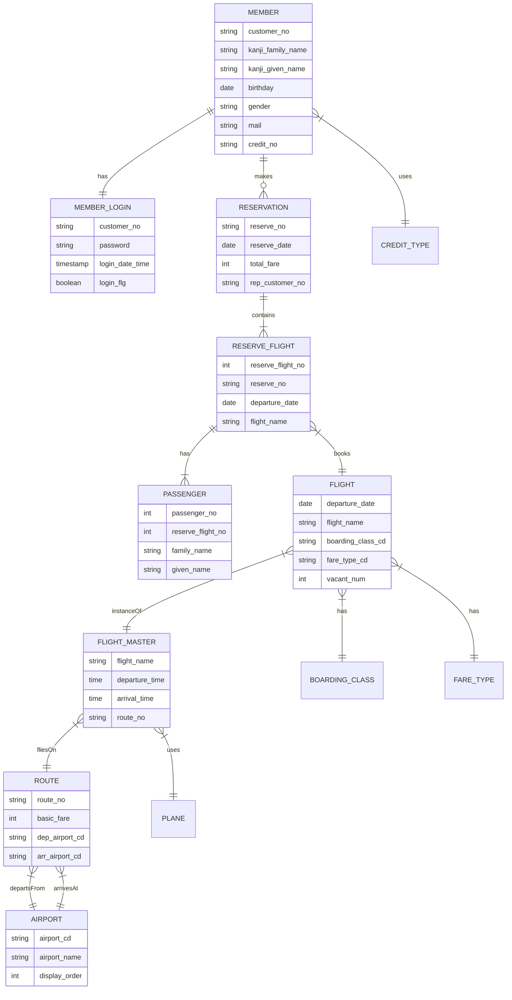

### 5.2 Core Entities

| Entity | Key Attributes | Description |
|--------|---------------|-------------|
| **Member** | customerNo, name, mail, creditNo | Registered customer |
| **MemberLogin** | password, loginFlg, loginDateTime | Login credentials |
| **Flight** | departureDate, flightName, vacantNum | Available flight with seats |
| **FlightMaster** | flightName, departureTime, arrivalTime | Flight schedule template |
| **Route** | routeNo, basicFare, airports | Route between airports |
| **Reservation** | reserveNo, totalFare, representative | Booking record |
| **ReserveFlight** | reserveFlightNo, flight details | Reserved flight segment |
| **Passenger** | name, age, gender | Traveler information |
| **FareType** | discountRate, reservationPeriod | Fare category rules |
| **BoardingClass** | extraCharge | Normal (N) or Special (S) class |
| **PeakTime** | dateRange, multiplicationRatio | Peak season pricing |

---

## 6. Service Layer

### 6.1 Service Architecture

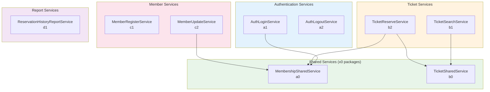

### 6.2 Service Responsibilities

| Service | Package | Key Operations |
|---------|---------|----------------|
| **MembershipSharedService** | a0 | `isMember(membershipNumber)` - Check member existence |
| **AuthLoginService** | a1 | `login(member)` - Update login status, timestamp |
| **AuthLogoutService** | a2 | `logout(member)` - Update logout status |
| **TicketSharedService** | b0 | `calculateFare()`, `validateFlightList()`, `isAvailableFareType()` |
| **TicketSearchService** | b1 | `searchFlight(criteria)` - Find available flights |
| **TicketReserveService** | b2 | `registerReservation()`, `calculateTotalFare()`, `validateReservation()` |
| **MemberRegisterService** | c1 | `register(member)` - Create new member |
| **MemberUpdateService** | c2 | `updateMember()`, `checkMemberPassword()` |
| **ReservationHistoryReportService** | d1 | `sendRequest()`, `createReport()` - Async via JMS |

### 6.3 Fare Calculation Logic

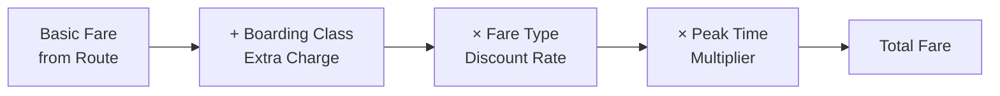

---

## 7. Web Layer

### 7.1 Controller Flow

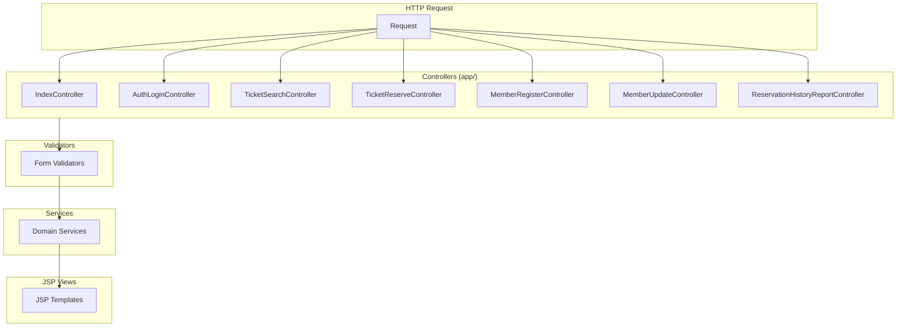

### 7.2 Web Endpoints

| Controller | Base Path | Endpoints |
|------------|-----------|-----------|
| **IndexController** | `/` | GET → redirect to `/ticket/search?topForm` |
| **AuthLoginController** | `/auth/login` | GET (form), POST (login) |
| **TicketSearchController** | `/ticket/search` | GET?topForm, GET?form, GET?flightForm, POST |
| **TicketReserveController** | `/ticket/reserve` | GET?form, POST?confirm, POST, GET?complete |
| **MemberRegisterController** | `/member/register` | GET?form, POST?confirm, POST, GET?complete |
| **MemberUpdateController** | `/member/update` | GET?form, POST, GET?complete |
| **ReservationHistoryReportController** | `/HistoryReport/*` | GET?form, POST, GET?reportList |

### 7.3 User Journey - Ticket Reservation

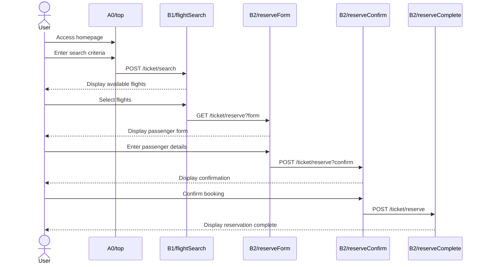

### 7.4 View Mapping

| View Path | Controller | Purpose |
|-----------|------------|---------|
| `A0/top` | TicketSearchController | Homepage with search form |
| `A1/loginForm` | AuthLoginController | Login page |
| `B1/flightSearch` | TicketSearchController | Flight search results |
| `B2/reserveForm` | TicketReserveController | Passenger input |
| `B2/reserveConfirm` | TicketReserveController | Booking confirmation |
| `B2/reserveComplete` | TicketReserveController | Success page |
| `C1/memberRegister*` | MemberRegisterController | Registration flow |
| `C2/memberUpdateForm` | MemberUpdateController | Profile update |
| `D1/*` | ReservationHistoryReportController | Report generation |

---

## 8. REST API Layer

### 8.1 API Architecture

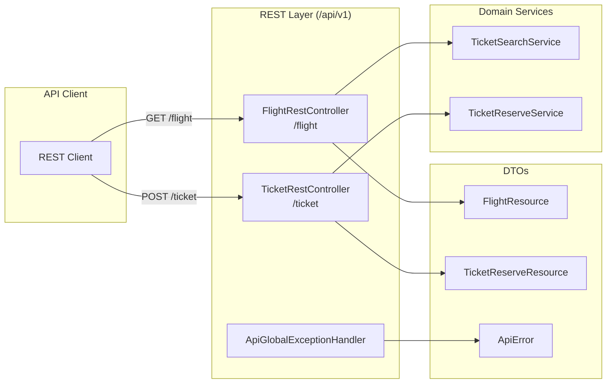

### 8.2 REST Endpoints

| Method | Endpoint | Request | Response | Status |
|--------|----------|---------|----------|--------|
| GET | `/api/v1/flight` | FlightSearchQuery | FlightResource[] | 200 |
| POST | `/api/v1/ticket` | TicketReserveResource | TicketReserveResource | 201 |
| GET | `/api/v1/ticket/check` | reserveNo | TicketReserveResource | 200 |

### 8.3 Resource Models

```java
// FlightResource
{
  "flightName": "NH001",
  "departureDate": "2024-01-15",
  "departureTime": "08:00",
  "arrivalTime": "10:30",
  "departureAirport": "HND",
  "arrivalAirport": "ITM",
  "boardingClass": "N",
  "fareTypes": [
    {
      "fareTypeCd": "EC",
      "fareTypeName": "Economy",
      "fare": 15000,
      "vacantNum": 50
    }
  ]
}

// TicketReserveResource
{
  "reserveNo": "RSV00001234",
  "flights": [...],
  "passengers": [...],
  "totalFare": 30000
}
```

---

## 9. Security Architecture

### 9.1 Security Filter Chain

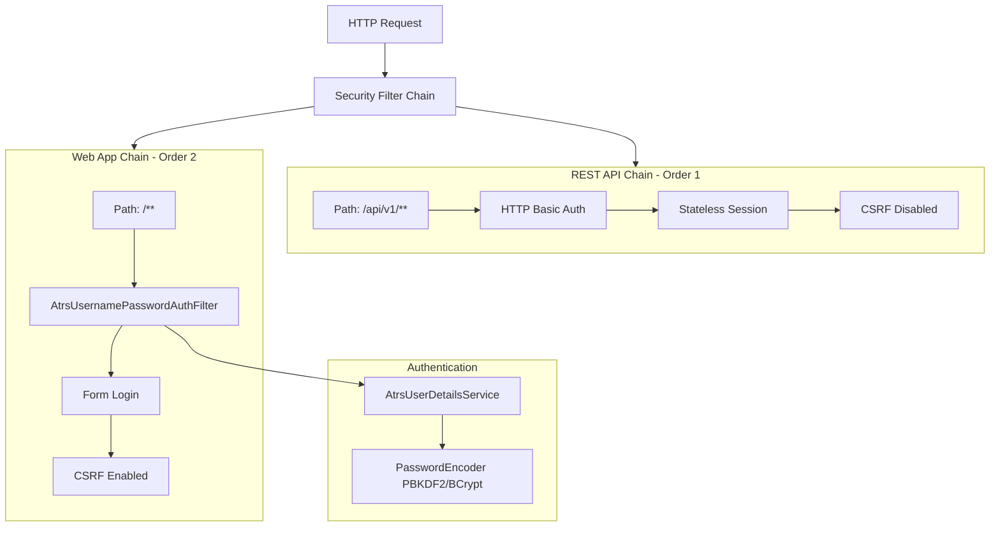

### 9.2 Security Configuration

| Aspect | Configuration |
|--------|--------------|
| **Password Encoding** | DelegatingPasswordEncoder (pbkdf2 default, bcrypt supported) |
| **Session** | Web: Session-based, REST: Stateless |
| **CSRF** | Web: Enabled with cookie repository, REST: Disabled |
| **Login URL** | POST `/auth/dologin` (membershipNumber, password) |
| **Logout URL** | `/auth/dologout` |
| **Protected URLs** | `/member/update/**`, `/HistoryReport/**` (ROLE_MEMBER) |

### 9.3 Authentication Flow

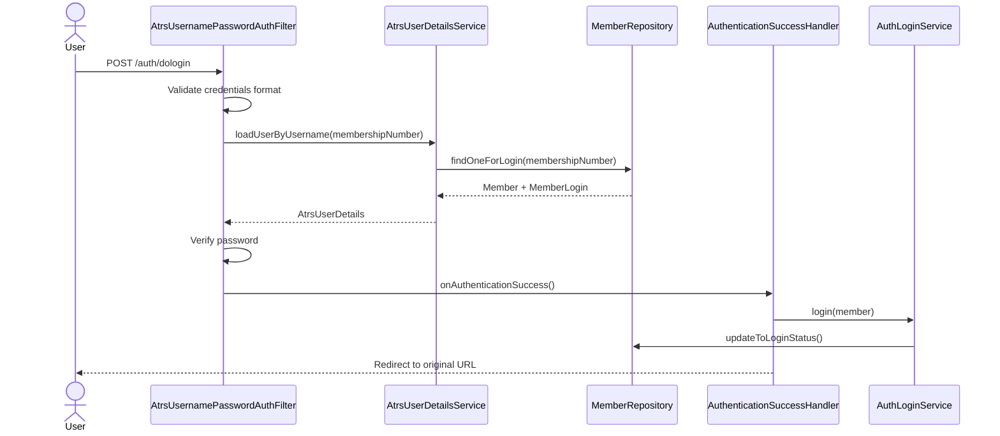

---

## 10. Database Design

### 10.1 Physical Schema

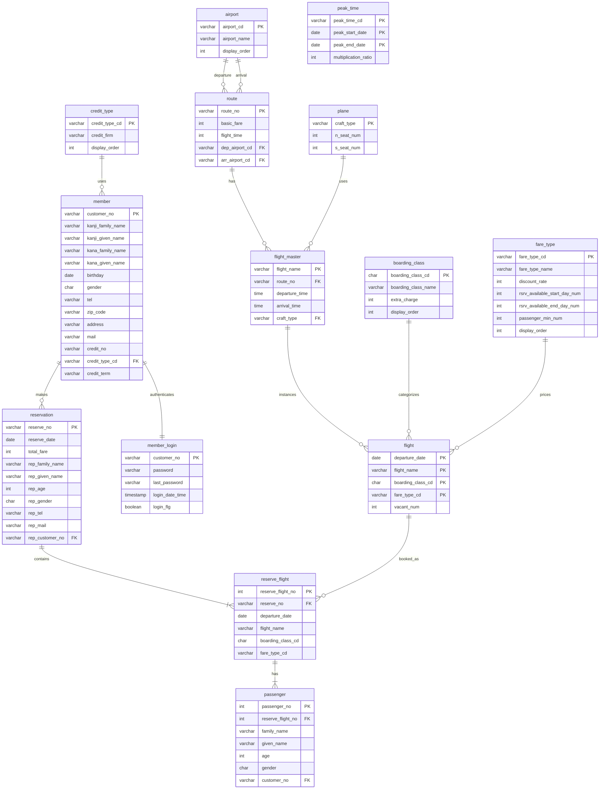

### 10.2 Database Sequences

| Sequence | Target Table | Purpose |
|----------|--------------|---------|
| SQ_MEMBER_1 | member | customer_no generation |
| SQ_RESERVATION_1 | reservation | reserve_no generation |
| SQ_RESERVE_FLIGHT_1 | reserve_flight | reserve_flight_no |
| SQ_PASSENGER_1 | passenger | passenger_no |

### 10.3 Key Indexes

| Table | Index | Columns |
|-------|-------|---------|
| flight | PK | (departure_date, flight_name, boarding_class_cd, fare_type_cd) |
| member | PK | (customer_no) |
| reservation | PK | (reserve_no) |
| reserve_flight | FK | (reserve_no) |

---

## 11. Configuration Management

### 11.1 Configuration Classes

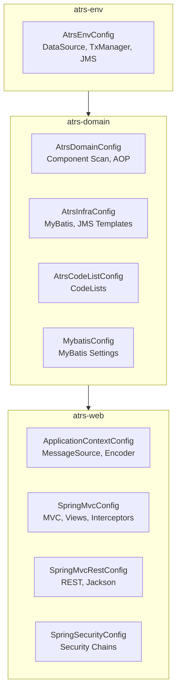

### 11.2 Configuration Details

| Config Class | Module | Key Beans |
|--------------|--------|-----------|
| **AtrsEnvConfig** | env | `dataSource`, `transactionManager`, `jmsConnectionFactory` |
| **AtrsDomainConfig** | domain | Component scan, `@Transactional` advice |
| **AtrsInfraConfig** | domain | `SqlSessionFactory`, `JmsTemplate` |
| **AtrsCodeListConfig** | domain | Airport, FareType, BoardingClass, Gender codelists |
| **ApplicationContextConfig** | web | `MessageSource`, `PasswordEncoder`, JMS listener |
| **SpringMvcConfig** | web | View resolver, interceptors, exception resolver |
| **SpringMvcRestConfig** | web | Jackson converter, REST exception handling |
| **SpringSecurityConfig** | web | Security filter chains, authentication |

### 11.3 CodeLists

| Bean Name | Source | Purpose |
|-----------|--------|---------|
| CL_AIRPORT | DB (airport) | Airport dropdown |
| CL_BOARDINGCLASS | DB (boarding_class) | Class selection |
| CL_FARETYPE | DB (fare_type) | Fare type selection |
| CL_CREDITTYPE | DB (credit_type) | Credit card types |
| CL_GENDER | SimpleMap | M/F selection |
| CL_FLIGHTTYPE | SimpleMap | RT/OW selection |
| CL_CREDITYEAR | NumberRange(00-99) | Expiry year |
| CL_CREDITMONTH | NumberRange(01-12) | Expiry month |

---

## 12. Cross-Cutting Concerns

### 12.1 Exception Handling

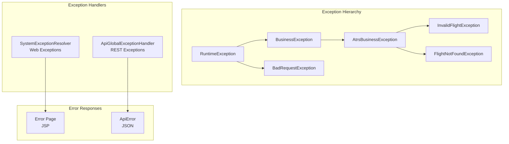

### 12.2 Transaction Management

| Aspect | Configuration |
|--------|--------------|
| Transaction Manager | Spring DataSourceTransactionManager |
| Propagation | REQUIRED (default) |
| Isolation | READ_COMMITTED |
| Rollback | RuntimeException |

### 12.3 Logging

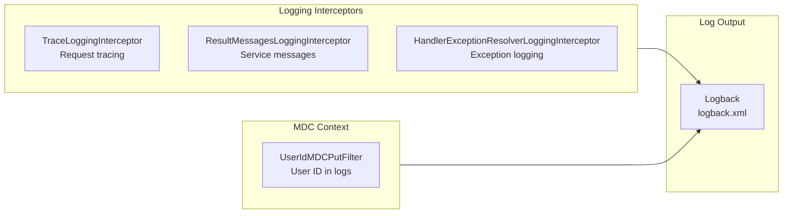

### 12.4 Transaction Token (CSRF Alternative)

Used for double-submit prevention on critical operations:
- `/member/register` - Member registration
- `/ticket/reserve` - Ticket booking
- `/HistoryReport/create` - Report generation

### 12.5 Async Processing (JMS)

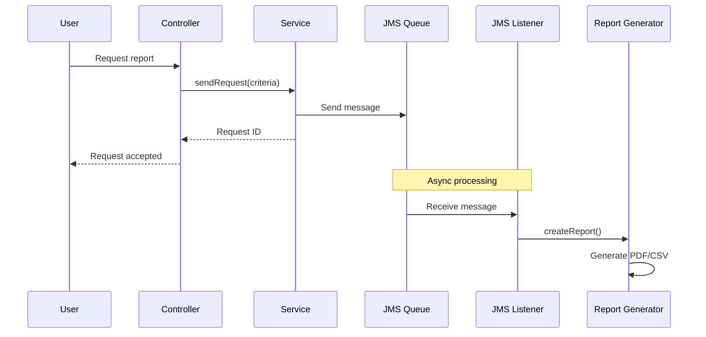

---

## 13. Architecture Assessment

### 13.1 Strengths

| Area | Assessment |
|------|------------|
| **Layered Architecture** | Clean separation: web → service → repository → data |
| **Module Structure** | Well-organized multi-module Maven project |
| **Security** | Comprehensive Spring Security with custom filters |
| **Configuration** | Proper use of Java-based Spring configuration |
| **Code Organization** | Feature-based package naming (a0-d1) aids navigation |
| **Transaction Management** | Declarative transactions with proper boundaries |
| **API Design** | RESTful endpoints with proper HTTP status codes |
| **Error Handling** | Centralized exception handling for both web and REST |
| **Async Processing** | JMS-based async for long-running operations |
| **Validation** | Custom validators with business rule enforcement |

### 13.2 Potential Improvements

| Area | Current State | Recommendation |
|------|--------------|----------------|
| **Test Coverage** | Limited test classes visible | Add unit/integration tests |
| **API Documentation** | None visible | Add OpenAPI/Swagger |
| **Caching** | Not implemented | Add caching for static data (airports, routes) |
| **Connection Pooling** | Basic DataSource | Consider HikariCP tuning |
| **Monitoring** | Basic logging | Add Spring Boot Actuator or Micrometer |
| **Container Support** | WAR deployment | Add Docker/Kubernetes support |
| **CI/CD** | Not visible | Add GitHub Actions pipeline |

### 13.3 Technology Stack Assessment

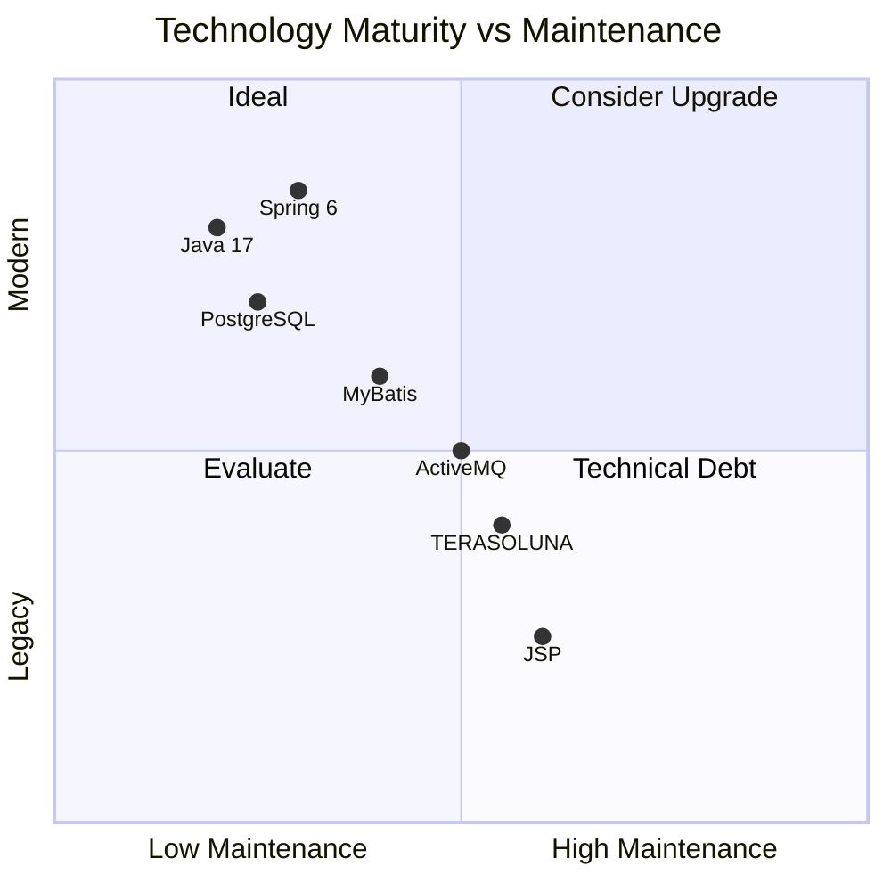

### 13.4 Scalability Considerations

| Component | Current | Scalability Path |
|-----------|---------|------------------|
| **Web Tier** | Single WAR | Horizontal scaling with load balancer |
| **Database** | Single PostgreSQL | Read replicas, connection pooling |
| **Session** | Server-side | External session store (Redis) |
| **JMS** | Embedded ActiveMQ | External message broker cluster |
| **Static Assets** | Served by Tomcat | CDN for production |

### 13.5 Security Assessment

| Aspect | Status | Notes |
|--------|--------|-------|
| Authentication | Good | Custom filter with proper validation |
| Password Storage | Good | PBKDF2/BCrypt with delegating encoder |
| Session Management | Good | Spring Security managed |
| CSRF Protection | Good | Enabled for web, disabled for REST (stateless) |
| Input Validation | Good | Bean validation + custom validators |
| SQL Injection | Good | MyBatis parameterized queries |
| XSS | Partial | JSP escaping needed |

### 13.6 Overall Architecture Rating

| Criterion | Score (1-5) | Notes |
|-----------|-------------|-------|
| Modularity | 4 | Well-structured multi-module project |
| Maintainability | 4 | Clear separation of concerns |
| Testability | 3 | Good structure but limited tests |
| Scalability | 3 | Stateful design limits horizontal scaling |
| Security | 4 | Comprehensive Spring Security |
| Performance | 3 | No caching, basic connection management |
| Documentation | 2 | Limited inline/external documentation |
| **Overall** | **3.5** | Solid enterprise architecture with room for modernization |

---

## Appendix A: File Structure

```
JavaConfig-JSP/atrs/
├── pom.xml                          # Parent POM
├── atrs-env/                        # Environment configuration
│   ├── pom.xml
│   └── src/main/
│       ├── java/.../config/app/AtrsEnvConfig.java
│       └── resources/
│           ├── META-INF/spring/atrs-infra.properties
│           └── logback.xml
├── atrs-domain/                     # Business logic
│   ├── pom.xml
│   └── src/main/java/.../domain/
│       ├── model/                   # Entities
│       ├── repository/              # MyBatis mappers
│       └── service/a0-d1/           # Services
├── atrs-web/                        # Web & API
│   ├── pom.xml
│   └── src/main/
│       ├── java/.../
│       │   ├── app/                 # Controllers
│       │   ├── api/                 # REST APIs
│       │   └── config/              # Configuration
│       ├── resources/i18n/          # Messages
│       └── webapp/
│           ├── WEB-INF/views/       # JSP views
│           └── resources/           # Static assets
└── atrs-initdb/                     # Database scripts
    ├── pom.xml
    └── src/sqls/                    # SQL files
```

---

## Appendix B: Quick Reference

### Build Commands
```bash
cd JavaConfig-JSP/atrs/
mvn clean install                        # Build all
mvn sql:execute -f atrs-initdb/pom.xml   # Init DB
mvn cargo:run -pl atrs-web               # Run app
```

### Key URLs
| URL | Purpose |
|-----|---------|
| http://localhost:8080/atrs/ | Homepage |
| http://localhost:8080/atrs/auth/login | Login |
| http://localhost:8080/atrs/ticket/search | Flight search |
| http://localhost:8080/atrs/member/register | Registration |

### Default Test User
| Field | Value |
|-------|-------|
| Membership Number | (from 00230_insert_member.sql) |
| Password | (hashed in database) |

---

*Document generated from codebase analysis of JavaConfig-JSP variant*
