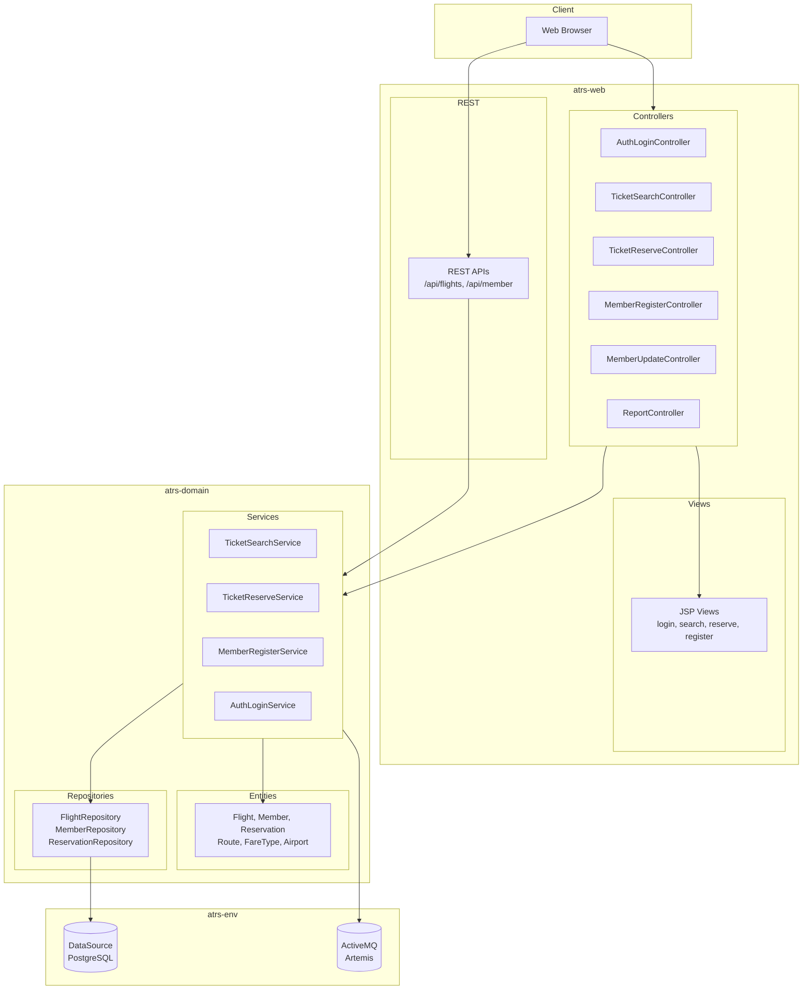
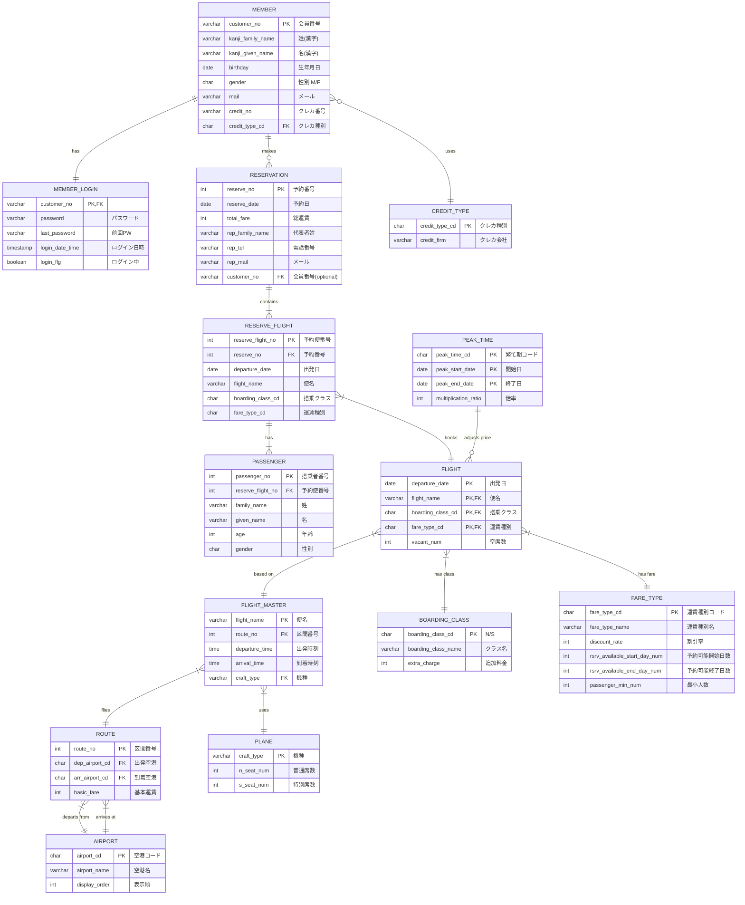
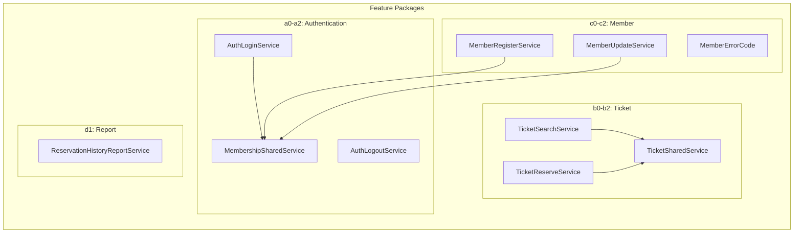
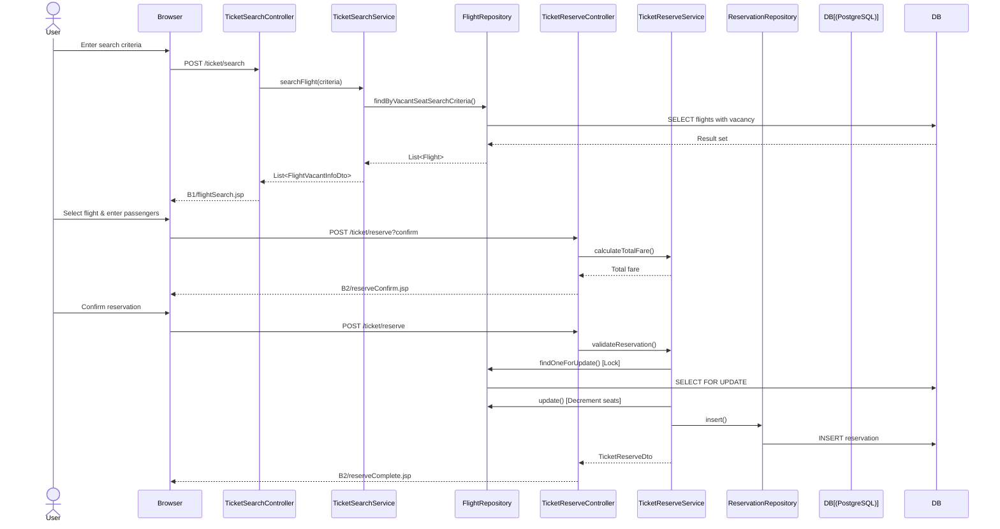
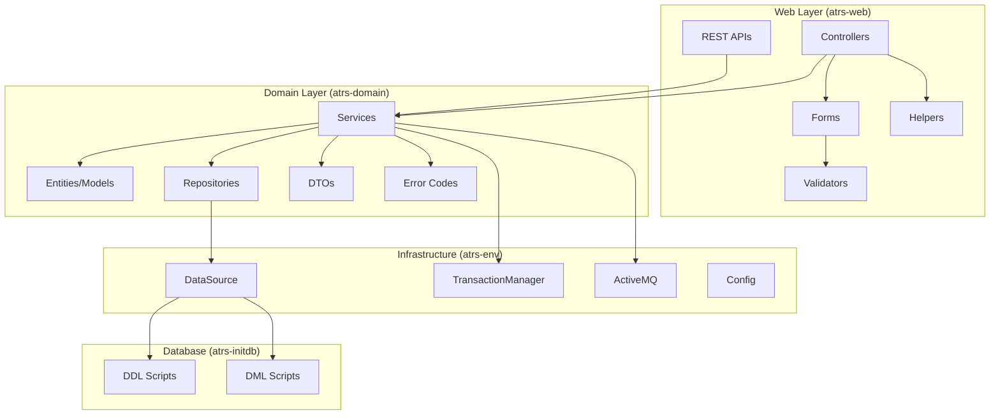
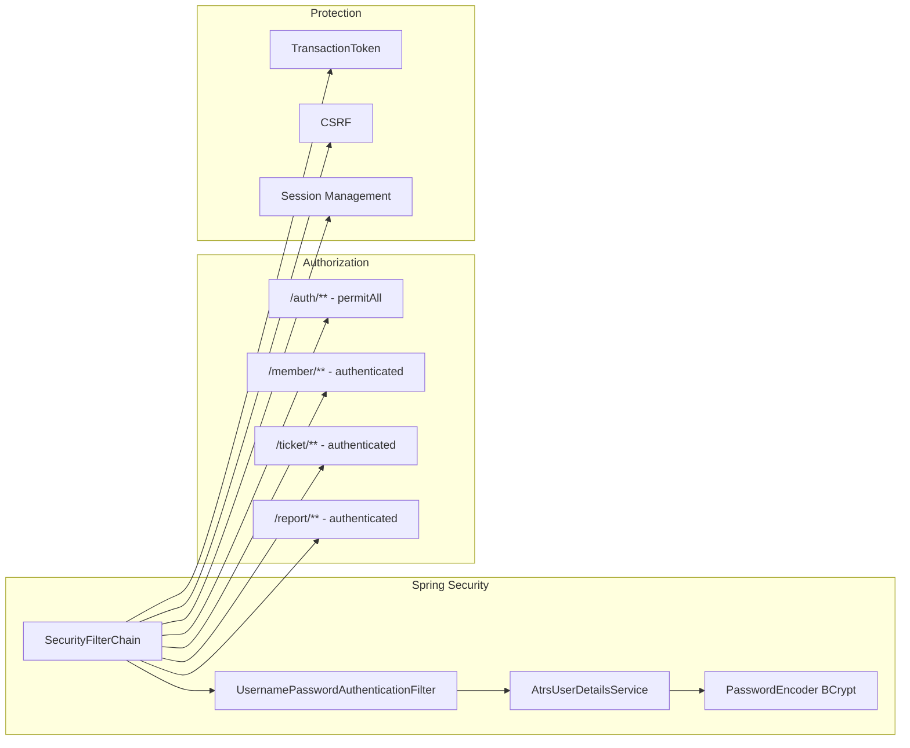
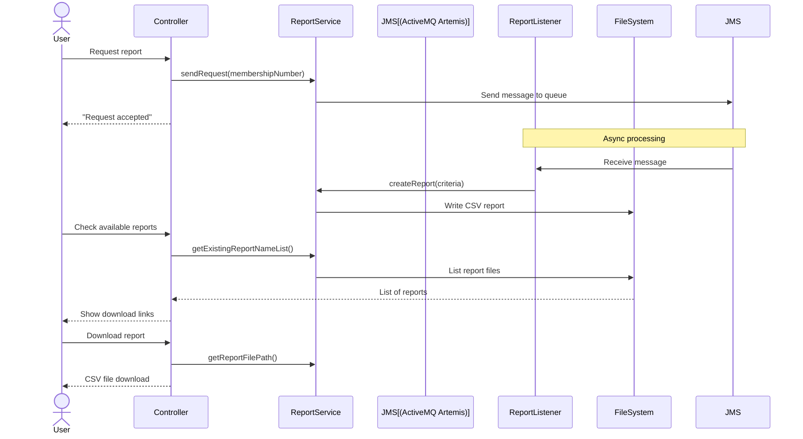
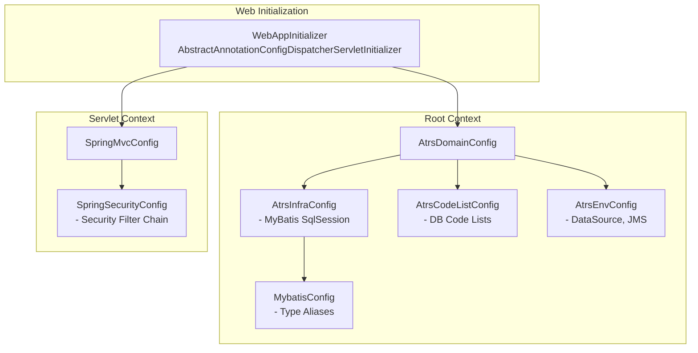
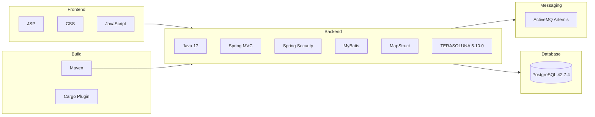

# JavaConfig-JSP/atrs - Architecture Design Document

## Executive Summary

**Airline Ticket Reservation System (ATRS)** - A Java Spring-based web application for booking airline tickets, managing memberships, and generating reservation reports.

| Attribute | Value |
|-----------|-------|
| **Type** | Monolithic Web Application |
| **Stack** | Java 17, Spring MVC, MyBatis, PostgreSQL, JSP |
| **Framework** | TERASOLUNA Framework 5.10.0 |
| **Architecture** | 3-Tier Layered (Web → Domain → Infrastructure) |

---

## 1. Module Structure

```
┌─────────────────────────────────────────────────────────────────┐
│                        JavaConfig-JSP/atrs                       │
├─────────────────────────────────────────────────────────────────┤
│                                                                  │
│  ┌──────────────┐  ┌──────────────┐  ┌──────────────┐           │
│  │   atrs-web   │  │ atrs-domain  │  │   atrs-env   │           │
│  │ Controllers  │──│   Services   │──│   Config     │           │
│  │ REST APIs    │  │   Entities   │  │  DataSource  │           │
│  │ JSP Views    │  │ Repositories │  │     JMS      │           │
│  └──────────────┘  └──────────────┘  └──────────────┘           │
│                                                                  │
│  ┌──────────────────────────────────────────────────────────┐   │
│  │                      atrs-initdb                          │   │
│  │               SQL Scripts (DDL + DML)                     │   │
│  └──────────────────────────────────────────────────────────┘   │
└─────────────────────────────────────────────────────────────────┘
```

| Module | Purpose | Key Dependencies |
|--------|---------|------------------|
| **atrs-web** | Controllers, REST APIs, Views, Security | Spring MVC, Spring Security |
| **atrs-domain** | Business logic, Entities, Repositories | MyBatis, MapStruct |
| **atrs-env** | Environment config (DataSource, JMS) | DBCP2, ActiveMQ Artemis |
| **atrs-initdb** | Database initialization scripts | sql-maven-plugin |

---

## 2. High-Level Architecture



---

## 3. Database Schema (ER Diagram)



---

## 4. Service Layer Architecture



### Service Methods Summary

| Service | Methods |
|---------|---------|
| **TicketSearchService** | `searchFlight(criteria)` → List&lt;FlightVacantInfoDto&gt; |
| **TicketReserveService** | `calculateTotalFare()`, `validateReservation()`, `registerReservation()` |
| **TicketSharedService** | `getSearchLimitDate()`, `validateFlightList()`, `calculateBasicFare()`, `calculateFare()` |
| **MemberRegisterService** | `register(member)` → Member with generated ID |
| **MemberUpdateService** | `findMember()`, `updateMember()`, `checkMemberPassword()` |
| **AuthLoginService** | `login(member)` - updates login status |
| **ReservationHistoryReportService** | `sendRequest()` (async JMS), `createReport()`, `getReportFilePath()` |

---

## 5. Request Flow - Ticket Booking



---

## 6. Fare Calculation Logic

```mermaid
flowchart TD
    A[Route.basicFare] --> B[+ BoardingClass.extraCharge]
    B --> C{Peak Time?}
    C -->|Yes| D[× PeakTime.multiplicationRatio]
    C -->|No| E[Basic Fare]
    D --> E
    E --> F{Passenger Age?}
    F -->|Child < 12| G[× childFareRate / 100]
    F -->|Adult| H[Keep Basic Fare]
    G --> I[Apply FareType Discount]
    H --> I
    I --> J[× (100 - discountRate) / 100]
    J --> K[Ceil to 100 yen]
    K --> L[Final Fare]
```

### Fare Type Rules

| Code | Name | Discount | Passengers | Booking Window |
|------|------|----------|------------|----------------|
| OW | 片道 (One-way) | 0% | 1+ | 90-0 days |
| RT | 往復 (Round-trip) | 5% | 1+ | 90-0 days |
| RD1 | 予約割1 (Advance 1) | 10% | 1+ | 60-1 days |
| RD7 | 予約割7 (Advance 7) | 20% | 1+ | 60-7 days |
| ED | 早期割 (Early) | 30% | 1+ | 60-30 days |
| LD | レディース割 (Ladies) | 30% | Women only | 60-1 days |
| GD | グループ割 (Group) | 30% | 3+ | 60-1 days |

---

## 7. Component Dependency Graph



---

## 8. Security Architecture



---

## 9. Async Report Generation (JMS)



---

## 10. Configuration Hierarchy



### Key Configuration Details

| Config Class | Responsibility |
|-------------|----------------|
| **AtrsDomainConfig** | Enables @Transactional, imports infra configs |
| **MybatisConfig** | mapUnderscoreToCamelCase, lazyLoading, type aliases |
| **AtrsCodeListConfig** | JdbcCodeList beans (airports, fare types, etc.) |
| **AtrsEnvConfig** | DBCP2 DataSource, TransactionManager, ActiveMQ |
| **SpringMvcConfig** | View resolver, interceptors, exception handlers |
| **SpringSecurityConfig** | Authentication, authorization, CSRF |

---

## 11. Design Patterns Used

| Pattern | Implementation |
|---------|----------------|
| **Service + Impl** | All services: `TicketSearchService` → `TicketSearchServiceImpl` |
| **Repository** | MyBatis mappers as repositories |
| **DTO** | `TicketSearchCriteriaDto`, `FlightVacantInfoDto`, `TicketReserveDto` |
| **Form Objects** | `TicketSearchForm`, `MemberRegisterForm` for web input |
| **Helper/Mapper** | `TicketHelper`, MapStruct `B1Mapper`, `B2Mapper` |
| **Provider** | `FareTypeProvider`, `RouteProvider` for cached master data |
| **Error Codes** | Enum-based: `TicketSearchErrorCode`, `MemberUpdateErrorCode` |
| **Validator** | Spring `Validator` interface: `TicketSearchValidator` |
| **Transaction Token** | `@TransactionTokenCheck` for double-submit prevention |

---

## 12. API Endpoints Summary

### MVC Controllers (JSP Views)

| Path | Controller | Description |
|------|------------|-------------|
| `/` | IndexController | Redirect to home |
| `/auth/login` | AuthLoginController | Login form |
| `/ticket/search` | TicketSearchController | Flight search |
| `/ticket/reserve` | TicketReserveController | Booking flow |
| `/member/register` | MemberRegisterController | Registration |
| `/member/update` | MemberUpdateController | Profile update |
| `/report` | ReservationHistoryReportController | Report generation |

### REST APIs

| Path | Method | Description |
|------|--------|-------------|
| `/api/flights` | GET/POST | Flight search API |
| `/api/member` | GET/POST/PUT | Member CRUD |
| `/api/auth` | POST | Authentication |
| `/ticket` | POST | Reserve ticket |
| `/ticket/check` | GET | Verify reservation |

---

## 13. Technology Stack



---

## 14. Key Business Rules

1. **Booking Window**: Flights bookable up to 90 days in advance
2. **Representative**: Must be 18+ years old
3. **Child Fare**: Applies to passengers under 12 years
4. **Ladies Discount**: All passengers must be female
5. **Group Discount**: Minimum 3 passengers required
6. **Seat Locking**: Pessimistic lock via `SELECT FOR UPDATE`
7. **Payment Deadline**: Outbound flight departure date

---

## 15. Directory Structure

```
JavaConfig-JSP/atrs/
├── pom.xml                           # Parent POM
│
├── atrs-web/
│   ├── pom.xml
│   └── src/main/
│       ├── java/jp/co/ntt/atrs/
│       │   ├── app/                  # Controllers by feature
│       │   │   ├── a0/               # Common (top, header)
│       │   │   ├── a1/               # Login
│       │   │   ├── b1/               # Flight search
│       │   │   ├── b2/               # Reservation
│       │   │   ├── c1/               # Member register
│       │   │   ├── c2/               # Member update
│       │   │   ├── d1/               # Report
│       │   │   └── common/           # Error handling
│       │   ├── api/                  # REST APIs
│       │   └── config/               # Spring MVC, Security
│       ├── resources/
│       │   └── i18n/                 # Message bundles
│       └── webapp/
│           └── WEB-INF/views/        # JSP views
│
├── atrs-domain/
│   ├── pom.xml
│   └── src/main/java/jp/co/ntt/atrs/
│       ├── config/app/               # Domain config
│       │   ├── AtrsDomainConfig.java
│       │   ├── AtrsInfraConfig.java
│       │   ├── AtrsCodeListConfig.java
│       │   └── mybatis/MybatisConfig.java
│       └── domain/
│           ├── model/                # Entities
│           ├── repository/           # MyBatis repos
│           └── service/              # Business logic
│               ├── a0/, a1/, a2/     # Auth services
│               ├── b0/, b1/, b2/     # Ticket services
│               ├── c0/, c1/, c2/     # Member services
│               └── d1/               # Report service
│
├── atrs-env/
│   ├── pom.xml
│   ├── configs/tomcat10-postgresql/  # Container config
│   └── src/main/
│       ├── java/.../AtrsEnvConfig.java
│       └── resources/
│           └── META-INF/spring/atrs-infra.properties
│
└── atrs-initdb/
    ├── pom.xml
    └── src/sqls/integration-test-postgres/
        ├── 00000_drop_all_tables.sql
        ├── 00100_create_all_tables.sql
        ├── 00200_insert_fixed_value.sql
        └── 002xx_insert_*.sql
```

---

## 16. Build & Run Commands

```bash
# Build
cd JavaConfig-JSP/atrs/
mvn clean install

# Initialize Database (PostgreSQL: db=atrs, user/pass=postgres)
mvn sql:execute -f atrs-initdb/pom.xml

# Run Application
mvn cargo:run -pl atrs-web

# Access: http://localhost:8080/atrs/
```

---

*Document generated: December 2024*
